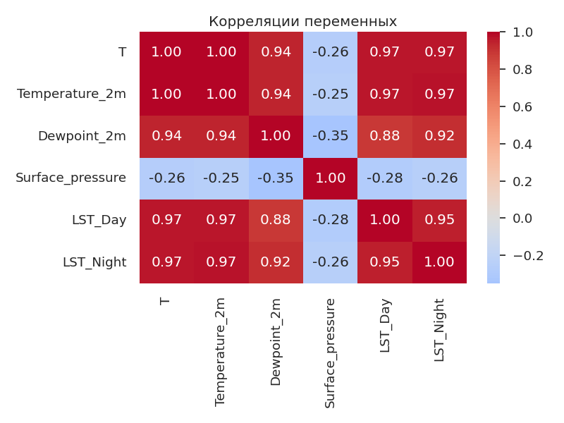
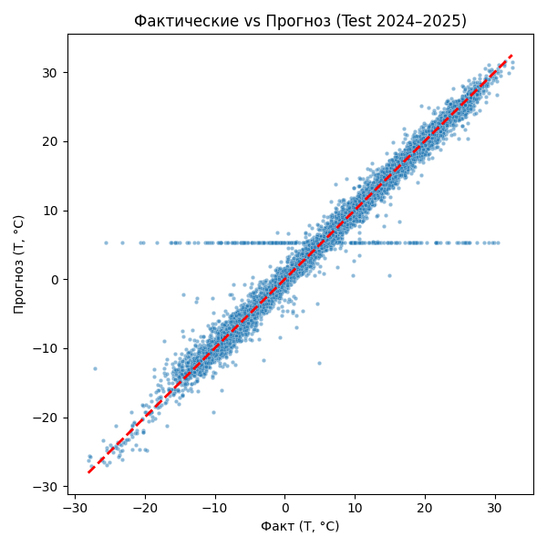
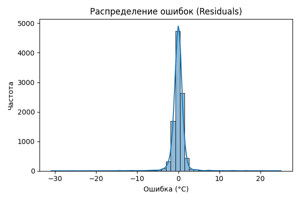
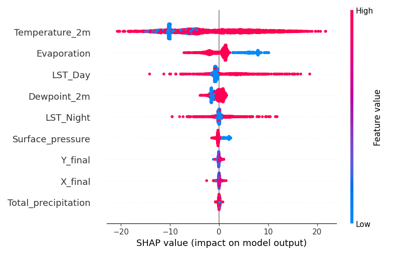
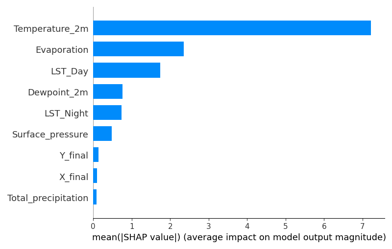
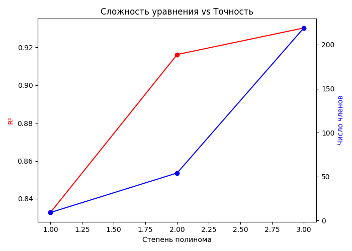
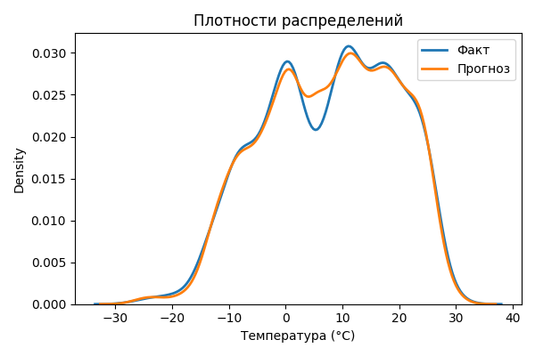

# Восстановление температуры по данным MODIS LST и ERA5 с помощью XGBoost

Этот репозиторий содержит код и результаты исследования по восстановлению наземной температуры `T` по спутниковым (MODIS LST) и реанализным (ERA5) данным с использованием моделей машинного обучения.  
Основная цель — оценить точность нелинейных моделей (XGBoost) и сравнить их с линейными аппроксимациями.

---

## 📂 Структура репозитория

- `eda.py` — разведочный анализ данных (EDA).
- `xgb_optuna_timesplit.py` — подбор гиперпараметров XGBoost через Optuna.
- `xgb_infer_full.py` — прогон лучшей модели на всём датасете.
- `shap_analysis.py` — SHAP-анализ признаков.
- `poly_regression_compare.py` — линейные и полиномиальные аппроксимации.
- `linear_regression_all_features.py` — линейная модель на всех признаках.
- `eda_plots/` — визуализации распределений и корреляций.
- `outputs_runs/` — результаты запусков (графики, метрики, модели).

---

## 🔹 1. Данные

- Период: **2013–2023**, ~208 тыс. строк.  
- Признаки:
  - **ERA5**: `Temperature_2m`, `Dewpoint_2m`, `Surface_pressure`, `Evaporation`, `Total_precipitation`
  - **MODIS**: `LST_Day`, `LST_Night`
  - **Наземные наблюдения**: `T`
  - Координаты: `X_final`, `Y_final`

### Пропуски
- `T` — ~73%  
- `LST_Day`, `LST_Night` — ~60% (облачность MODIS)  
- ERA5 — ~12%  

---

## 🔹 2. Разведочный анализ данных (EDA)

- Построены распределения всех признаков, сезонные графики, корреляции.  
- Наибольшая корреляция у целевой переменной `T` наблюдается с `Temperature_2m`, `Dewpoint_2m` и `LST_Day`.

  

**Вывод:** несмотря на высокую корреляцию ERA5 `Temperature_2m` с `T`, другие признаки (Evaporation, LST, Dewpoint) вносят значимый вклад. Это подтверждается SHAP-анализом.

---

## 🔹 3. Учёт временного ряда

Так как данные имеют временную структуру, важно было избежать «подсматривания в будущее».

- **Обучение (train):** 2013–2021  
- **Тестирование (test):** 2022–2023  
- Для подбора гиперпараметров использовался KFold внутри train (2013–2021).  

Таким образом, модель проверялась на будущем интервале времени, что делает результаты честными.  

---

## 🔹 4. Моделирование (XGBoost)

- Подбор гиперпараметров через Optuna (500 итераций, GPU).  
- Использовался `tree_method = hist`, `device = cuda`.

### Метрики на тесте (2022–2023)
R² = 0.9684
RMSE = 2.06 °C
MAE = 0.98 °C
MedAE= 0.60 °C

  
  

**Вывод:** модель объясняет ~97% дисперсии и предсказывает температуру с ошибкой менее 1 °C в среднем.

---

## 🔹 5. Интерпретация модели (SHAP-анализ)

SHAP-анализ (на подвыборке 3000 строк) показал, что главные признаки:

1. ERA5 `Temperature_2m`  
2. ERA5 `Evaporation`  
3. MODIS `LST_Day`  
4. ERA5 `Dewpoint_2m`  
5. MODIS `LST_Night`

  
  

**Интерпретация:**
- Рост `Temperature_2m` и `LST_Day` повышает предсказанное значение `T`.  
- Высокие значения `Evaporation` имеют отрицательный вклад (обусловлено физикой процессов: интенсивное испарение чаще связано с понижением приземной температуры).  
- `Dewpoint_2m` вносит дополнительную информацию о влажности и тепловом балансе.  

---

## 🔹 6. Уравнения пересчёта

Для наглядности построены линейные и полиномиальные аппроксимации.

### Линейная регрессия (топ-5 признаков)
T ≈ 0.92 * Temperature_2m

1.02 * Evaporation

0.0013 * LST_Day

0.089 * Dewpoint_2m

1.23

- R² ≈ 0.83

### Полиномиальные модели (топ-9 признаков)
- 1-я степень → R² ≈ 0.83, 9 коэффициентов  
- 2-я степень → R² ≈ 0.92, 54 коэффициента  
- 3-я степень → R² ≈ 0.93, 219 коэффициентов  

  

**Вывод:** усложнение уравнения резко увеличивает число коэффициентов, но почти не повышает точность. XGBoost остаётся оптимальным выбором.

---

## 🔹 7. Результаты на всём датасете (2013–2023)

Прогон лучшей модели на всех данных:

R² = 0.939
RMSE = 3.01 °C
MAE = 1.24 °C
MedAE= 0.53 °C
SMAPE= 5.6%

  

### По годам и месяцам
- R² стабильно > 0.92 по всем годам.  
- Ошибки выше зимой (MODIS чаще закрыт облаками).  
- По станциям выявлены аномальные точки с высоким RMSE.

---

## 📊 Итоги

- Модель XGBoost достигает **R² ≈ 0.97** на независимом тесте и ~0.94 на всём массиве.  
- SHAP-анализ подтвердил, что, помимо `Temperature_2m`, вклад вносят `Evaporation`, `LST_Day`, `Dewpoint_2m`.  
- Линейная аппроксимация объясняет только ~83% дисперсии. Полиномы дают прирост, но ценой сотен коэффициентов.  
- Для практического применения предпочтительна **нелинейная модель**.  

---

## 📂 Дальнейшие шаги

- Подготовка статьи (оформление результатов в журнальном формате).  
- Возможная реализация QGIS-плагина для автоматического пересчёта температуры по спутниковым данным.  
