## 1. Исходные данные

- Период: `2013-2023`
- Объём: `208278` строк
- Станций: `52`
- Наблюдений с известной `T`: `56238`
- Целевая: `T`
- Основные источники: ERA5 (`Temperature_2m`, `Dewpoint_2m`, `Surface_pressure`, `Evaporation`, `Total_precipitation`) + MODIS (`LST_Day`, `LST_Night`)

Пропуски:

- `T`: `73.00%`
- `LST_Day`: `61.18%`
- `LST_Night`: `59.90%`
- ERA5-признаки: `12.33%`

  

  
  

Итог этапа: сильнейший базовый сигнал идёт от `Temperature_2m`, но основной прирост качества фиксируется только после добавления календарных, лаговых и пространственных признаков.

---

## 2. Подтверждённая траектория улучшений

Метрики test (`2022-2023`):

| Этап | Скрипт / Run | R2 | RMSE | MAE |
|---|---|---:|---:|---:|
| Базовый timesplit | `xgb/xgb_optuna_timesplit.py` / `20250905_142927` | 0.9684 | 2.0564 | 0.9750 |
| Extra-features v2 | `xgb/xgb_optuna_with_extra_features_v2.py` / `20250915_165542_extra_v2` | 0.9868 | 1.3300 | 0.8482 |
| Лаги `t-1` | `xgb/xgb_optuna_with_lags.py` / `20250916_154740_lags` | 0.9875 | 1.2945 | 0.7963 |
| Лаги `t-1..t-3` | `xgb/xgb_optuna_with_lags123.py` / `20250916_163343_lags123_fix` | 0.9896 | 1.1816 | 0.7452 |
| Лаги `t-1..t-3` + spatial | `xgb/xgb_optuna_with_lags123_spatial.py` / `20250916_171729_lags123_spatial` | 0.9898 | 1.1675 | 0.7189 |

Итог этапа: подтверждённый путь улучшения был линейным и понятным: сезонные/производные признаки дали основной скачок от базового timesplit, лаговый блок ещё снизил ошибку, spatial-блок и `station_train_mean_T` довели ветку до лучшего результата на полном датасете.

---

## 3. Лучшая рабочая база

Скрипт: `xgb/xgb_optuna_with_lags123_spatial.py`  
Run: `outputs_runs/20250916_171729_lags123_spatial`

Что закрепилось как рабочая база:

- лаги `t-1, t-2, t-3` по `Temperature_2m`, `Dewpoint_2m`, `LST_Day`, `LST_Night`
- календарные признаки `dayofyear`, `sin_doy`, `cos_doy`, `month`
- производные признаки `dewpoint_dep`, `diurnal_range`
- spatial-блок `sin/cos(lat, lon)` или его нормированная замена по координатам
- station-level признак `station_train_mean_T`
- всего в подтверждённом run используется `31` признак
- схема обучения: `train = 2013-2021`, `test = 2022-2023`
- внутренняя валидация для подбора гиперпараметров: `inner_train = 2013-2020`, `inner_val = 2021`
- подбор параметров: `Optuna + XGBoost + early stopping`, без обычной `k-fold`-кросс-валидации

Метрики test (`2022-2023`):

- `R2 = 0.9898`
- `RMSE = 1.1675`
- `MAE = 0.7189`
- `MedAE = 0.4992`

  
  

Итог этапа: именно ветка `lags123 + spatial` остаётся лучшей подтверждённой базой на полном наборе станций; более поздние прогоны её по сути диагностировали, но не превзошли.

---

## 4. Что не стало основной веткой

Сезонное разбиение (`xgb/xgb_optuna_with_extra_features_seasonal.py`, `20250915_094512_seasonal`):

- Cold: `R2 = 0.9450`, `RMSE = 1.5472`, `MAE = 0.9546`
- Warm: `R2 = 0.9708`, `RMSE = 1.1383`, `MAE = 0.7684`

Post-bias по станциям (`xgb/xgb_optuna_with_lags123_spatial_bias.py`, `20250916_173641_lags123_spatial_bias`):

- до коррекции: `R2 = 0.9897`, `RMSE = 1.1773`, `MAE = 0.7239`
- после коррекции: `R2 = 0.9897`, `RMSE = 1.1773`, `MAE = 0.7239`
- эффект на уровне шума, прироста относительно обычной `lags123_spatial` нет

Long-run и ансамбль (`xgb/xgb_optuna_with_lags123_spatial_longrun.py`, `xgb/xgb_optuna_with_lags123_spatial_longrun_ens5.py`):

- long-run: `R2 = 0.9893`, `RMSE = 1.1961`, `MAE = 0.7304`
- ens5: `R2 = 0.9894`, `RMSE = 1.1927`, `MAE = 0.7286`

Итог этапа: усложнение бустинга и post-bias-коррекция не дали выигрыша над обычной веткой `lags123_spatial`; основной прирост в проекте принесли именно признаки, а не дополнительная инженерия поверх уже обученной модели.

---

## 5. Подтверждённые слабые места

### 5.1 Зимний режим

База `lags123_spatial` по месяцам хуже всего работает в холодный сезон:

- январь: `MAE = 1.0841`
- февраль: `MAE = 0.8258`
- декабрь: `MAE = 0.7526`
- для сравнения, август: `MAE = 0.5451`

Отдельный зимний прогон (`xgb/xgb_optuna_winter_only.py`, `20250923_111926_winter_only`) это подтвердил:

- `R2 = 0.9514`
- `RMSE = 1.4540`
- `MAE = 0.8516`

### 5.2 Station-wise доменный сдвиг

Диагностический прогон `xgb/xgb_optuna_with_error_map.py` (`20250923_114911_error_map`) показал, что основная проблема сосредоточена не в среднем уровне ошибки, а в отдельных станциях:

- худшая станция на test: `35108`, `MAE = 2.5119`
- следующая группа по ухудшению: `35007`, `27857`, `27995`, `34289`

  

Проверка `xgb/xgb_optuna_with_lags123_spatial_exclude35108.py` это отдельно подтвердила:

- с `35108`: `R2 = 0.9894`, `RMSE = 1.1913`, `MAE = 0.7281`
- без `35108`: `R2 = 0.9954`, `RMSE = 0.7774`, `MAE = 0.5920`

Итог: станция `35108` даёт непропорционально большой вклад в хвост ошибки; это важная диагностика, но не новая базовая модель, потому что задача при исключении станции становится проще.

### 5.3 Остаточная временная структура

Скрипт: `xgb/xgb_optuna_with_resid_acf_pacf.py`  
Run: `outputs_runs/20250923_172831_resid_acf_pacf`

- `R2 = 0.9892`
- `RMSE = 1.2037`
- `MAE = 0.7343`
- Ljung-Box остаётся значимым на ряде станций, наиболее резко на `35108`

  

Итог этапа: при высоком среднем `R2` у модели всё ещё остаются недоубранные временные зависимости в остатках, особенно в зимнем режиме и на проблемных станциях.

---

## 6. Spatial Transfer Preflight

Скрипт: `transfer/spatial_transfer_preflight.py`  
Run: `outputs_runs/20260327_171818_spatial_transfer_preflight`

Постановка:

- `52` станции разделены на `west/east` по медиане долготы
- в каждой половине наблюдаемая `T` есть только у `7` станций
- режим `fewtrain` оставляет полный target-test, но в target-train сохраняет `T` только на `5` или `3` калибровочных станциях

Метрики test (`2022-2023`):

| Направление | Режим target-train | Лучший режим | R2 | RMSE | MAE |
|---|---|---:|---:|---:|
| `west -> east` | полный target-train | `scratch` | 0.9855 | 1.4800 | 0.8923 |
| `west -> east` | `5` станций | `finetune` | 0.9817 | 1.6579 | 0.9554 |
| `west -> east` | `3` станции | `scratch` | 0.9792 | 1.7695 | 1.0143 |
| `east -> west` | полный target-train | `scratch` | 0.9949 | 0.7713 | 0.5869 |
| `east -> west` | `5` станций | `scratch` | 0.9951 | 0.7614 | 0.5850 |
| `east -> west` | `3` станции | `scratch` | 0.9946 | 0.7958 | 0.6115 |

  

Итог этапа: переносимость оказалась выраженно асимметричной. Направление `west -> east` заметно сложнее `east -> west`, что согласуется с уже выявленными проблемами на восточном кластере станций. При `5` калибровочных станциях few-shot-адаптация ещё удерживает качество, но при `3` станциях деградация уже явная; `zero-shot` стабильно слабее, чем `finetune/scratch`, на сложной стороне.

---

## 7. Проверки устойчивости до следующего регионального шага

### 7.1 Winter transfer (мульти-сид)

Скрипт: `transfer/run_winter_transfer_multiseed.py`  
Run: `outputs_runs/20260407_161100_volgograd_winter_multiseed_full5`

Постановка:

- winter-only выборка (`11,12,1,2,3`)
- перенос `Saratov -> Volgograd`
- `5` сидов (`42/52/62/72/82`) в режимах `zero-shot`, `finetune`, `scratch`

Агрегированные test-метрики по сидам:

| Ветка | R2 mean ± std | RMSE mean ± std | MAE mean ± std | n |
|---|---:|---:|---:|---:|
| `scratch` | 0.9758 ± 0.0004 | 0.9360 ± 0.0086 | 0.6775 ± 0.0042 | 3624 |
| `finetune` | 0.9748 ± 0.0004 | 0.9561 ± 0.0082 | 0.6955 ± 0.0064 | 3624 |
| `zero-shot` | 0.9427 ± 0.0043 | 1.4409 ± 0.0544 | 1.0166 ± 0.0230 | 3624 |

  

Итог этапа: зимний ranking устойчив по сидам и не меняет общий вывод transfer-ветки: `scratch` лучше `finetune`, `zero-shot` заметно слабее.

### 7.2 LOSO stress-test по станциям (Саратов)

Скрипт: `transfer/saratov_loso_stress.py`  
Run: `outputs_runs/20260407_160800_saratov_loso_full14`

Постановка:

- `leave-one-station-out` на всех `14` станциях с наблюдаемой `T` на test `2022-2023`
- обучение на остальных станциях тем же базовым feature-набором

Сводные метрики:

- `RMSE_mean = 1.0633`
- `RMSE_median = 0.8310`
- `MAE_mean = 0.8151`
- худшая станция: `35108`, `RMSE = 4.0368`
- лучшая станция: `34059`, `RMSE = 0.6927`

  

Итог этапа: station-wise неустойчивость подтверждена в более жёсткой постановке с unseen station; основной хвост ошибки остаётся на `35108`.

### 7.3 Интервалы неопределённости (P10/P50/P90)

Скрипт: `transfer/saratov_uncertainty_intervals.py`  
Run: `outputs_runs/20260407_161900_saratov_uncertainty_full_calibrated`

Сводные test-метрики интервалов:

- `coverage(P10,P90) = 0.7209`
- целевой coverage: `0.80`
- `coverage_gap = -0.0791`
- средняя ширина интервала: `2.0423`
- `P50`: `MAE = 0.7093`, `RMSE = 1.1380`

  
  

Итог этапа: интервалы пока недокрывают фактическую неопределённость (coverage ниже цели), особенно по отдельным месяцам.

### 7.4 Winter hybrid (full + winter specialist)

Скрипт: `transfer/saratov_winter_hybrid_experiment.py`  
Run: `outputs_runs/20260407_163025_saratov_winter_hybrid`

Постановка:

- базовая full-year модель обучается на `2013-2021` и тестируется на `2022-2023`
- отдельная winter-only модель обучается только на месяцах `11,12,1,2,3`
- в hybrid-прогнозе значения для зимних месяцев берутся из winter-only модели, остальные месяцы остаются из full-year модели

Сравнение на test:

| Срез | База (full) | Hybrid (full+winter) |
|---|---:|---:|
| `RMSE` (полный test) | 1.1450 | 1.1553 |
| `MAE` (полный test) | 0.7094 | 0.7148 |
| `RMSE` (winter) | 1.3588 | 1.3796 |
| `MAE` (winter) | 0.8065 | 0.8197 |

  

Итог этапа: раздельная winter-ветка в текущей реализации не улучшила качество ни на зимнем срезе, ни на полном test; базовая full-year модель остаётся сильнее.

### 7.5 Winter weight scan (одна модель, взвешивание зимы)

Скрипт: `transfer/saratov_winter_weight_scan.py`  
Run: `outputs_runs/20260407_163846_saratov_winter_weight_scan`

Постановка:

- обучалась одна full-year модель на `2013-2021`
- зимним наблюдениям (`11,12,1,2,3`) в train назначался вес `factor`
- проверены `factor = 1.0 / 1.15 / 1.3 / 1.5 / 1.8 / 2.2`

Ключевые результаты (`2022-2023`):

- baseline `factor=1.0`: `RMSE_full=1.1450`, `MAE_full=0.7094`, `RMSE_winter=1.3588`, `MAE_winter=0.8065`
- лучший по full-RMSE (`factor=1.3`): `RMSE_full=1.1450`, `MAE_full=0.7066`, `RMSE_winter=1.3574`, `MAE_winter=0.8008`
- лучший по winter-RMSE (`factor=1.5`): `RMSE_full=1.1457`, `MAE_full=0.7083`, `RMSE_winter=1.3565`, `MAE_winter=0.8031`

  

Итог этапа: умеренное взвешивание зимних месяцев (`factor ~ 1.3-1.5`) даёт небольшой, но реальный прирост на зимнем срезе без заметной потери общего качества.

### 7.6 Winter transfer (мульти-сид x10, усиленный прогон)

Скрипт: `transfer/run_winter_transfer_multiseed.py`  
Run: `outputs_runs/20260407_164430_volgograd_winter_multiseed_x10`

Постановка:

- winter-only выборка (`11,12,1,2,3`)
- перенос `Saratov -> Volgograd`
- `10` сидов (`42..132`) в режимах `zero-shot`, `finetune`, `scratch`
- усиленные настройки: `n_trials=25`, `num_boost_round=3500`

Агрегированные test-метрики по сидам:

| Ветка | R2 mean ± std | RMSE mean ± std | MAE mean ± std | n |
|---|---:|---:|---:|---:|
| `scratch` | 0.9761 ± 0.0002 | 0.9317 ± 0.0039 | 0.6757 ± 0.0025 | 3624 |
| `finetune` | 0.9751 ± 0.0005 | 0.9507 ± 0.0092 | 0.6915 ± 0.0076 | 3624 |
| `zero-shot` | 0.9442 ± 0.0037 | 1.4220 ± 0.0480 | 1.0027 ± 0.0267 | 3624 |

  

Итог этапа: при увеличении числа сидов и более тяжёлом тюнинге ranking не изменился; `scratch` стабильно лучший, `finetune` второй, `zero-shot` заметно слабее.

### 7.7 Spatial preflight (усиленный прогон)

Скрипт: `transfer/spatial_transfer_preflight.py`  
Run: `outputs_runs/20260407_164430_spatial_transfer_preflight_serious_fix`

Постановка:

- проверка пространственного переноса в двух направлениях: `east->west` и `west->east`
- режимы калибровки: `all`, `fewtrain05`, `fewtrain03`
- настройки: `n_trials=18`, `num_boost_round=3000`, `zero_inflated_precip=True`

Метрики `scratch` по кейсам:

| Направление | Режим | R2 | RMSE | MAE | n |
|---|---|---:|---:|---:|---:|
| `east->west` | `all` | 0.9950 | 0.7680 | 0.5845 | 5110 |
| `east->west` | `fewtrain05` | 0.9949 | 0.7758 | 0.5925 | 5110 |
| `east->west` | `fewtrain03` | 0.9945 | 0.7993 | 0.6138 | 5110 |
| `west->east` | `all` | 0.9860 | 1.4536 | 0.8739 | 5110 |
| `west->east` | `fewtrain05` | 0.9809 | 1.6941 | 0.9862 | 5110 |
| `west->east` | `fewtrain03` | 0.9798 | 1.7424 | 0.9997 | 5110 |

  

Итог этапа: асимметрия переноса подтверждена ещё раз; `east->west` остаётся существенно легче, `west->east` резко деградирует при сокращении калибровочных станций.

### 7.8 Интервалы неопределённости (strict rerun)

Скрипт: `transfer/saratov_uncertainty_intervals.py`  
Runs:

- `outputs_runs/20260407_164430_saratov_uncertainty_cov80_strict`
- `outputs_runs/20260407_164430_saratov_uncertainty_cov85_strict`

Сводка test-метрик:

| Run | target coverage | coverage(P10,P90) | coverage gap | width mean | P50 RMSE | P50 MAE |
|---|---:|---:|---:|---:|---:|---:|
| `cov80_strict` | 0.80 | 0.6210 | -0.1790 | 1.6837 | 1.1762 | 0.7253 |
| `cov85_strict` | 0.85 | 0.7047 | -0.1453 | 1.9469 | 1.1414 | 0.7084 |

  
  

Итог этапа: даже в усиленном прогоне интервалы остаются недокалиброванными (coverage ниже цели); рост целевого уровня с `0.80` до `0.85` расширяет интервал и улучшает фактическое покрытие, но разрыв сохраняется.

### 7.9 Holdout conformal-калибровка интервалов

Скрипт: `transfer/saratov_uncertainty_intervals.py`  
Runs:

- `outputs_runs/20260407_184200_saratov_uncertainty_cov80_conformal_holdout`
- `outputs_runs/20260407_184700_saratov_uncertainty_cov85_conformal_holdout`

Что изменено в постановке:

- для conformal-калибровки убрана утечка по валидации
- tuning: `2013-2019`, tune-val: `2020`
- fit: `2013-2020`
- calibration holdout: `2021`
- метод: `calibration_method=conformal_monthly`

Сводка test-метрик:

| Run | target coverage | coverage(P10,P90) | coverage gap | coverage gain | width mean | P50 RMSE | P50 MAE |
|---|---:|---:|---:|---:|---:|---:|---:|
| `cov80_conformal_holdout` | 0.80 | 0.8068 | +0.0068 | +0.1161 | 2.4230 | 1.2207 | 0.7325 |
| `cov85_conformal_holdout` | 0.85 | 0.8633 | +0.0133 | +0.1953 | 2.7139 | 1.2451 | 0.7426 |

  
  

Итог этапа: holdout-conformal калибровка закрыла целевой coverage для обоих уровней (`0.80` и `0.85`), но ценой ожидаемого расширения интервалов и небольшого ухудшения центрального прогноза `P50`.

### 7.10 West->East: post-bias correction

Скрипты: `transfer/xgb_transfer_experiment.py`, `transfer/spatial_transfer_preflight.py`  
Run: `outputs_runs/20260407_185400_spatial_transfer_w2e_bias`

Постановка:

- только сложное направление `west -> east`
- режимы `all`, `fewtrain05`, `fewtrain03`
- включена `post-bias-correction` по residual на `target-train`
- в summary добавлены пары `mode` и `mode+bias`

Ключевой эффект по RMSE (test):

- `all`: `zero-shot 1.7908 -> 1.7822`, `scratch 1.4689 -> 1.4689`, `finetune 1.4906 -> 1.4906`
- `fewtrain05`: `zero-shot 1.7808 -> 1.7682`, `scratch 1.6741 -> 1.6741`, `finetune 1.6894 -> 1.6893`
- `fewtrain03`: `zero-shot 1.7609 -> 1.7517`, `scratch 1.7740 -> 1.7741`, `finetune 1.6989 -> 1.6990`

  

Итог этапа: station-bias correction даёт заметный плюс только для `zero-shot`; для `scratch/finetune` эффект близок к нулю и местами отрицательный.

### 7.11 West->East: station_month + winter weight scan

Скрипты: `transfer/xgb_transfer_experiment.py`, `transfer/spatial_transfer_preflight.py`  
Runs:

- `outputs_runs/20260407_191500_spatial_transfer_w2e_stationmonth_w10`
- `outputs_runs/20260407_192400_spatial_transfer_w2e_stationmonth_w13`
- `outputs_runs/20260407_193100_spatial_transfer_w2e_stationmonth_w15`
- сводка: `outputs_runs/20260407_194700_w2e_stationmonth_weight_scan_summary`

Постановка:

- направление только `west -> east`
- bias-коррекция: `post_bias_correction_mode=station_month`
- веса зимы в train: `winter_weight_factor = 1.0 / 1.3 / 1.5`
- режимы калибровки: `all`, `fewtrain05`, `fewtrain03`
- настройки: `n_trials=10`, `num_boost_round=2500`, `early_stopping_rounds=120`

Лучший RMSE внутри новой сетки (`station_month` + зимние веса):

| Калибровка | Лучший `winter_weight_factor` | Лучшая ветка | R2 | RMSE | MAE |
|---|---:|---|---:|---:|---:|
| `all` | `1.3` | `scratch+bias[station_month]` | 0.9859 | 1.4591 | 0.8771 |
| `fewtrain05` | `1.3` | `finetune+bias[station_month]` | 0.9813 | 1.6788 | 0.9690 |
| `fewtrain03` | `1.3` | `scratch+bias[station_month]` | 0.9808 | 1.7015 | 0.9953 |

Сравнение с предыдущим baseline `station`-bias (`20260407_185400_spatial_transfer_w2e_bias`):

- `all`: `RMSE 1.4689 -> 1.4591` (`-0.0098`)
- `fewtrain05`: `RMSE 1.6741 -> 1.6788` (`+0.0047`)
- `fewtrain03`: `RMSE 1.6989 -> 1.7015` (`+0.0025`)

  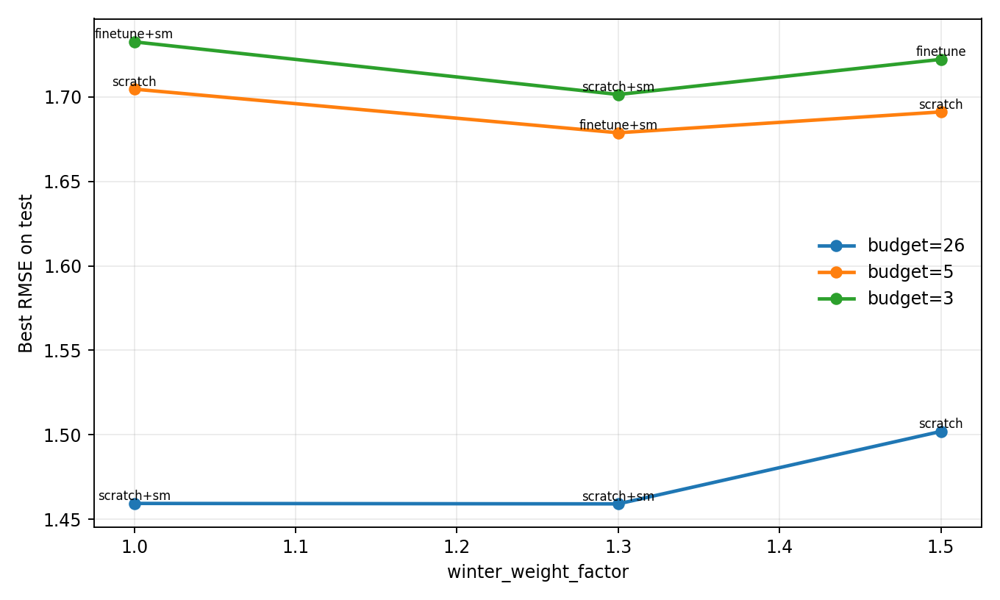

Итог этапа: в новой ветке оптимальным оказался `winter_weight_factor=1.3`; улучшение подтверждено для `all`, но на low-station режимах (`5/3`) выигрыш над предыдущим `station`-bias не получен.

### 7.12 Сводка по разделу 7

Что подтверждено артефактами:

- winter transfer на мульти-сиде устойчиво даёт ranking: `scratch > finetune >> zero-shot` (в quick, full5 и x10-сериях).
- spatial transfer остаётся асимметричным: `east->west` заметно легче, `west->east` системно сложнее.
- при сокращении калибровочных станций (`5/3`) качество в сложном направлении деградирует.
- station-wise стресс подтверждён в LOSO: основной хвост ошибки стабильно сосредоточен на `35108`.
- строгие uncertainty-прогоны (`cov80/85_strict`) показали недокрытие; holdout-conformal закрыл целевой coverage для `0.80` и `0.85`.

Что прироста не дало:

- отдельная winter-only ветка в `hybrid`-схеме ухудшила метрики относительно базовой full-year модели.
- post-bias correction в `station`-варианте практически не влияет на `scratch/finetune` (полезен в основном для `zero-shot`).
- `station_month + winter_weight` улучшает `west->east` в режиме `all`, но в `fewtrain05/03` устойчивого выигрыша над предыдущим baseline не показал.

Фактический итог раздела 7:

- лучшая ветка для сложного `west->east` в режиме `all`: `scratch+bias[station_month]`, `winter_weight_factor=1.3`, `RMSE=1.4591`, `MAE=0.8771`, `R2=0.9859`.

---

## 8. RP5 -> Росгидромет: расширенный калибровочный мост

Скрипты:

- `transfer/fetch_aisori_tttr_daily_playwright.py`
- `transfer/parse_aisori_tttr_zip.py`
- `transfer/extract_aisori_station_catalog.py`
- `transfer/fetch_bridge_rp5_meteostat_bulk.py`
- `transfer/build_rp5_hydromet_overlap.py`
- `transfer/rp5_hydromet_bridge.py`

### 8.A Базовый мост и первичные улучшения (`8.1-8.8`)

### 8.1 Массовая сборка RP5-like ряда

Собранные данные AISORI:

- merged daily: `data/rosgidromet/aisori/aisori_tttr_daily_2010_2025_merged.csv`
- `739616` строк, `137` станций, `2010-01-01 ... 2025-03-31`
- каталог станций: `data/rosgidromet/aisori/aisori_station_catalog.csv` (`137` станций)

Массовая выгрузка Meteostat (`2013-2023`) по AISORI-каталогу:

- requested station-set после фильтра по наличию гидромет-рядов: `133`
- успешная загрузка: `132` станции; не найдено в Meteostat: `32586`
- итоговый RP5-like CSV: `data/rosgidromet/bridge_inputs/rp5_meteostat_daily_2013_2023_allstations.csv`
- объём RP5-like ряда: `467577` строк, `132` станции

### 8.2 Overlap и отбор station-set для моста

Артефакты:

- overlap all-stations: `data/rosgidromet/bridge_inputs/rp5_meteostat_vs_hydromet_overlap_2013_2023_allstations.csv`
- station-wise stats: `data/rosgidromet/bridge_inputs/rp5_meteostat_station_overlap_stats_2013_2023.csv`
- summary: `data/rosgidromet/bridge_inputs/rp5_meteostat_station_overlap_stats_2013_2023.csv.summary.json`
- selected station-set: `transfer/hydromet_bridge_station_ids_selected.txt` (`125` станций)

Факты по overlap:

- all stations: `467007` строк, `132` станции, `2013-01-01 ... 2023-12-31`
- selected125: `462851` строк, `125` станций, `2013-01-01 ... 2023-12-31`
- критерии selected125: `min_hydromet_rows >= 1500`, `min_overlap_rows >= 1200`, `min_overlap_years >= 6`, `exact_equal_ratio <= 0.98`
- для selected125: `abs_delta_mean = 1.1215`, `abs_delta_median = 0.7000`, `abs_delta_max = 19.5000`
- `exact_equal_ratio = 0.0761`, `is_identical_overlap = false`

### 8.3 Метрики bridge (selected125)

Run-артефакты:

- schema-check: `outputs_runs/20260411_195225_rp5_hydromet_bridge_schema_selected125`
- full bridge: `outputs_runs/20260411_195225_rp5_hydromet_bridge_full_selected125`

Метрики `2022-2023`:

- baseline: `R2=0.9882`, `RMSE=1.6840`, `MAE=1.1344`
- bridge: `R2=0.9889`, `RMSE=1.6349`, `MAE=1.1186`
- прирост bridge: `RMSE -0.0491`, `MAE -0.0158`
- запуск с `--fail-on-identical` проходит (вырождение отсутствует)

Детализация эффекта:

- улучшение по станциям: `71/125`
- ухудшение по станциям: `54/125`
- средний station-wise gain (`baseline_mae - bridge_mae`): `+0.0076`
- улучшение по месяцам: `7/12` (наибольший плюс осень-зима: октябрь-декабрь)

<table align="center">
  <tr>
    <td align="center" width="50%">
      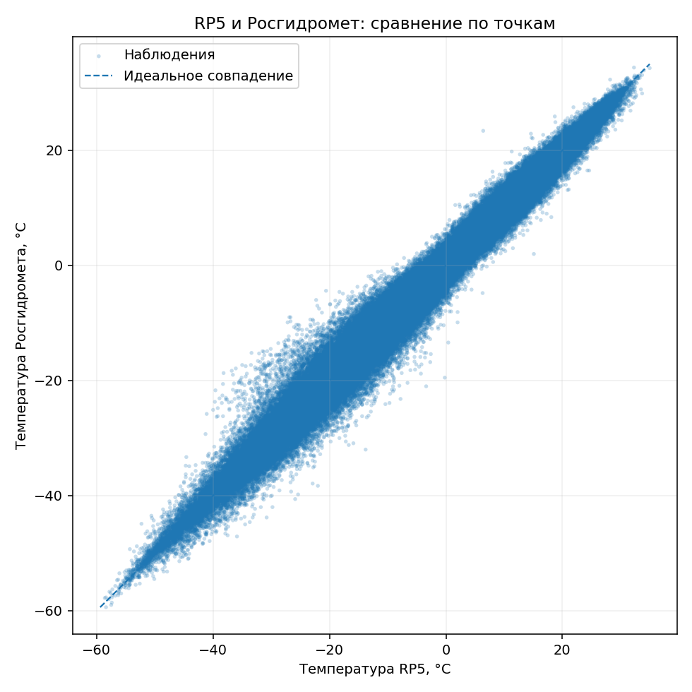
    </td>
    <td align="center" width="50%">
      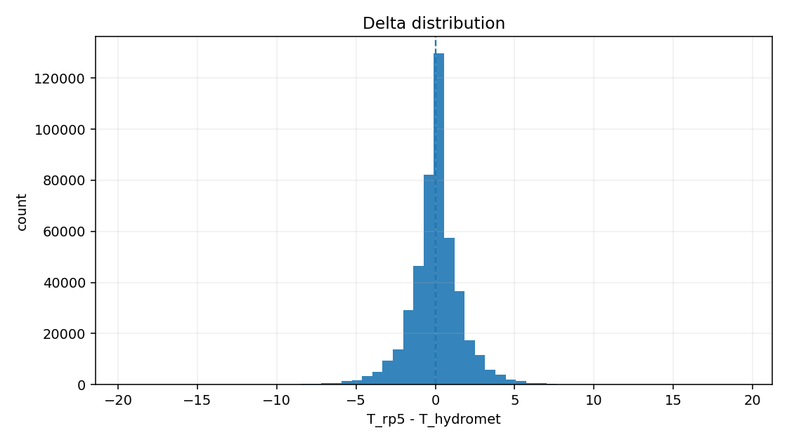
    </td>
  </tr>
</table>

Рис. 4. Слева: сравнение `T_rp5` и `T_hydromet`; справа: распределение `T_rp5 - T_hydromet` на selected125.

<table align="center">
  <tr>
    <td align="center" width="50%">
      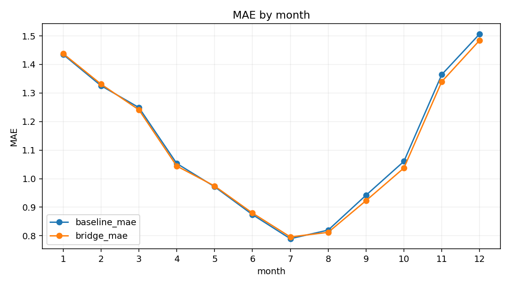
    </td>
    <td align="center" width="50%">
      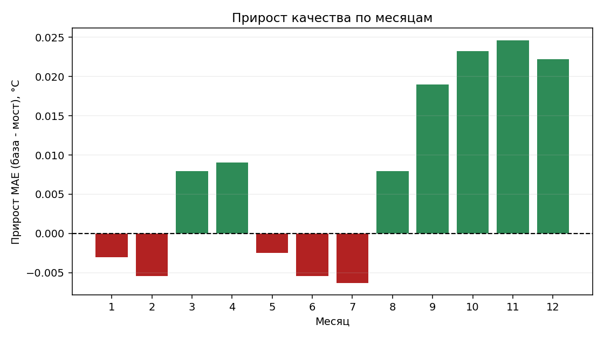
    </td>
  </tr>
</table>

Рис. 5. Слева: MAE базовой линии и моста по месяцам; справа: месячный прирост (`baseline - bridge`).

<table align="center">
  <tr>
    <td align="center" width="50%">
      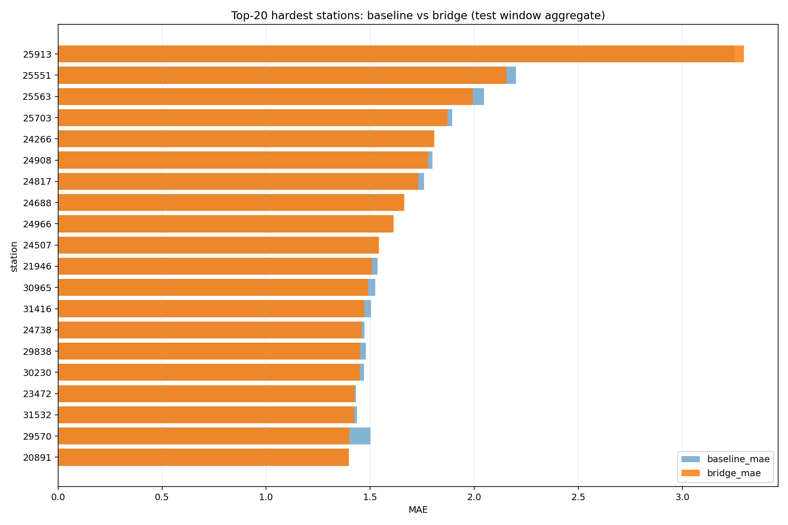
    </td>
    <td align="center" width="50%">
      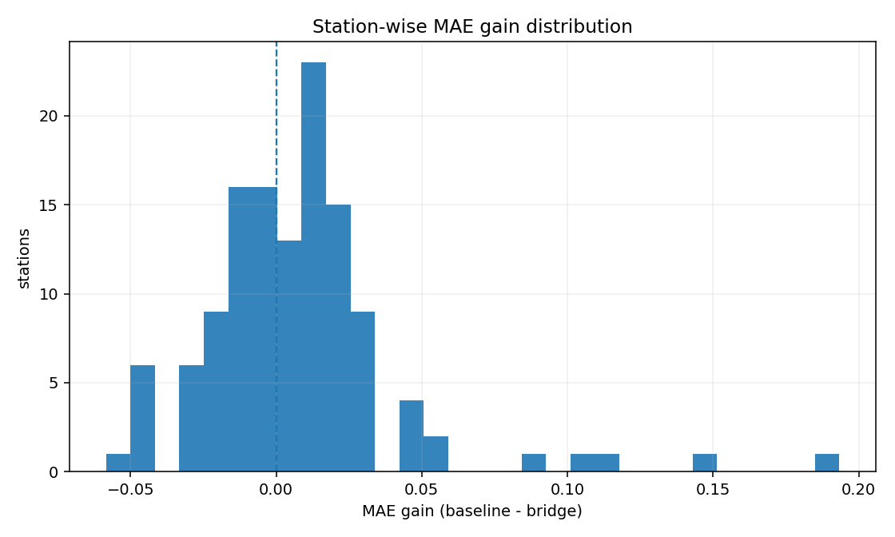
    </td>
  </tr>
</table>

Рис. 6. Слева: 20 станций с крайними значениями прироста; справа: распределение station-wise прироста MAE.

Итог этапа:

- bridge-пайплайн масштабирован с точечного smoke (`4` станции) до рабочего набора `125` станций
- на расширенном наборе мост остаётся невырожденным и даёт стабильный прирост к baseline по RMSE/MAE

### 8.4 Gated bridge по станциям

Скрипт: `transfer/rp5_hydromet_bridge_improvements.py`  
Run: `outputs_runs/20260411_201020_rp5_hydromet_bridge_improvements_selected125`

Постановка:

- сплит: `train <= 2020`, `calib = 2021`, `test = 2022-2023`
- gate открывается по станции, если на `calib` MAE модели лучше baseline (`T_rp5`) хотя бы на `gate_eps`

Результат gated-подхода:

- `ridge_gated`: gate открыт на `76` станциях
- `xgb_gated`: gate открыт на `72` станциях
- лучший gated-вариант: `xgb_gated` (см. 8.6)

### 8.5 Seasonal bridge (cold/warm)

Постановка:

- отдельный `ridge` для cold-месяцев (`11,12,1,2,3`)
- отдельный `ridge` для warm-месяцев (`4..10`)

Метрики test:

- `ridge_global`: `R2=0.9888`, `RMSE=1.6408`, `MAE=1.1228`
- `ridge_seasonal`: `R2=0.9892`, `RMSE=1.6086`, `MAE=1.1097`
- прирост seasonal vs global: `RMSE -0.0322`, `MAE -0.0132`

### 8.6 Nonlinear bridge (XGBoost)

Постановка:

- нелинейная регрессия `XGBoost` на признаках `T_rp5 + month + sin/cos_doy + station dummies`
- проверены `xgb_global` и `xgb_gated`

Метрики test:

| Вариант | R2 | RMSE | MAE |
|---|---:|---:|---:|
| `baseline` (`T_rp5`) | 0.9882 | 1.6840 | 1.1344 |
| `ridge_global` | 0.9888 | 1.6408 | 1.1228 |
| `ridge_gated` | 0.9888 | 1.6396 | 1.1149 |
| `ridge_seasonal` | 0.9892 | 1.6086 | 1.1097 |
| `xgb_global` | 0.9893 | 1.6039 | 1.1085 |
| `xgb_gated` | **0.9894** | **1.5932** | **1.0958** |
| `ridge_downweight` | 0.9888 | 1.6411 | 1.1240 |

Ключевой итог:

- лучший вариант по `calib` и `test`: `xgb_gated`
- прирост `xgb_gated` vs baseline: `RMSE -0.0908`, `MAE -0.0386`
- прирост `xgb_gated` vs `ridge_global`: `RMSE -0.0476`, `MAE -0.0270`
- по месяцам `xgb_gated` улучшил baseline во всех `12/12` месяцах

<table align="center">
  <tr>
    <td align="center" width="50%">
      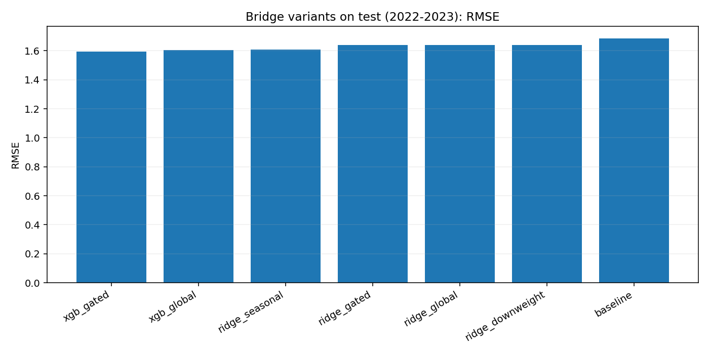
    </td>
    <td align="center" width="50%">
      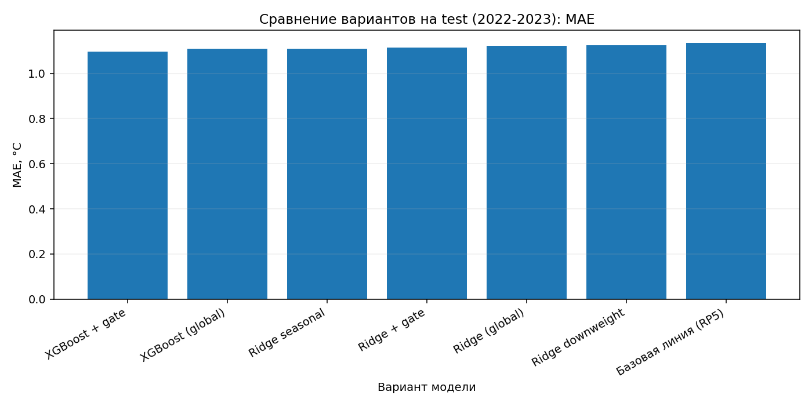
    </td>
  </tr>
</table>

Рис. 7. Сравнение вариантов улучшений моста на тесте по RMSE и MAE.

### 8.7 Downweight/фильтр тяжёлых станций

Постановка:

- тяжёлая станция: `(ridge_mae - baseline_mae) > 0.03` на `calib`
- найдено `16` тяжёлых станций
- в `ridge_downweight` train-сэмплы этих станций взвешены коэффициентом `0.35`

Факт:

- `ridge_downweight` не дал прироста относительно `ridge_global` (`RMSE +0.00035`, `MAE +0.00116`)
- в текущей настройке downweight полезен как диагностическая ветка, но не как новая база

### 8.8 Интервалы неопределённости (quantile + conformal)

Постановка:

- интервалы поверх лучшей point-ветки `xgb_gated`
- калибровка на `2021`, оценка на `2022-2023`
- сравнение двух методов: `global_quantile` (один `q` на весь набор) и `monthly_conformal` (отдельный `q` по каждому месяцу)

Сводка покрытия:

| Метод | Target | Achieved | Gap | Mean width |
|---|---:|---:|---:|---:|
| `global_quantile` | 0.80 | 0.8127 | +0.0127 | 3.6000 |
| `monthly_conformal` | 0.80 | 0.8106 | +0.0106 | 3.6533 |
| `global_quantile` | 0.85 | 0.8601 | +0.0101 | 4.2411 |
| `monthly_conformal` | 0.85 | 0.8581 | +0.0081 | 4.2888 |
| `global_quantile` | 0.90 | 0.9067 | +0.0067 | 5.2010 |
| `monthly_conformal` | 0.90 | 0.9055 | +0.0055 | 5.2030 |

<table align="center">
  <tr>
    <td align="center" width="50%">
      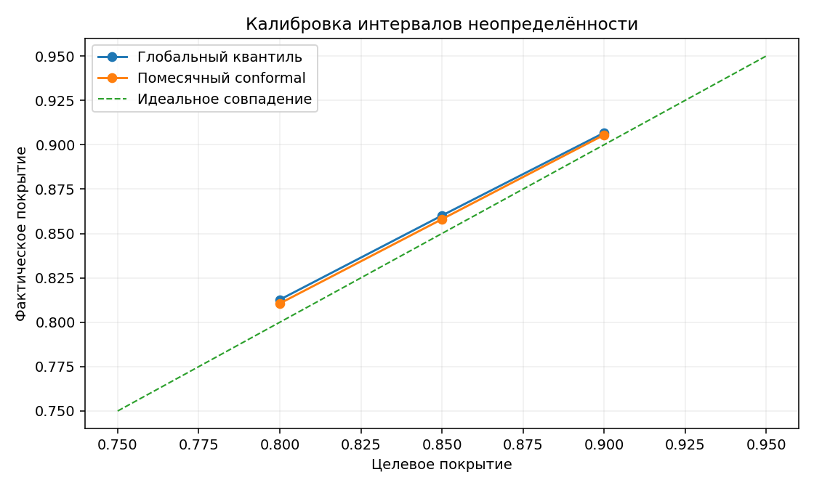
    </td>
    <td align="center" width="50%">
      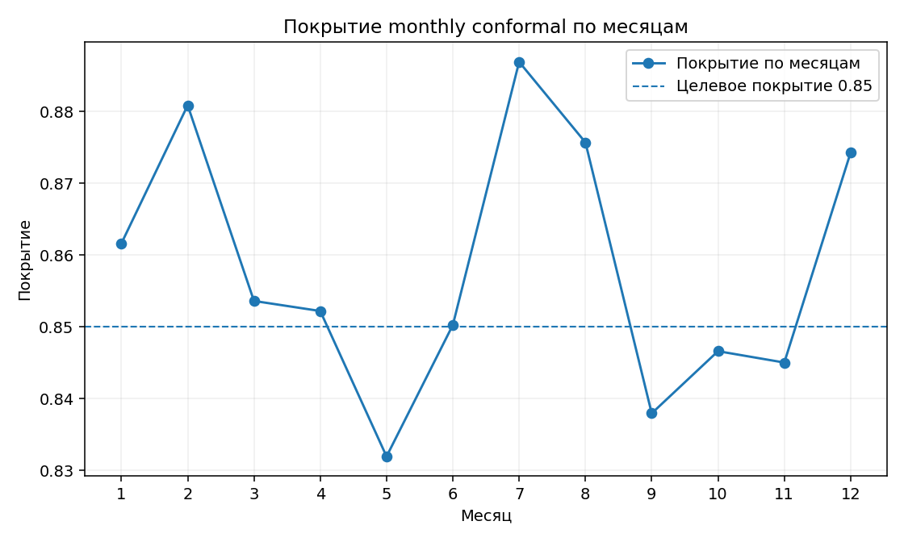
    </td>
  </tr>
</table>

Рис. 8. Слева: целевое и фактическое покрытие; справа: помесячное покрытие monthly conformal (цель = 0.85).

### 8.B Стабилизация профиля (`8.9-8.16`)

### 8.9 Сводка улучшений по пункту 8

- `gated` стратегия подтвердилась как рабочая; лучший результат дала `xgb_gated`
- seasonal-разделение улучшает линейный bridge относительно обычного `ridge_global`
- нелинейный bridge (`XGBoost`) даёт лучший point-прогноз на selected125
- downweight тяжёлых станций в текущей конфигурации прироста не дал
- uncertainty-блок закрыт: интервалы quantile/conformal калиброваны и стабильно попадают в target coverage

### 8.10 Повторный прогон: station-month gate и soft-blend

Скрипт: `transfer/rp5_hydromet_bridge_improvements.py`  
Run: `outputs_runs/20260411_214201_rp5_hydromet_bridge_improvements_selected125`

Что донастроено:

- `min_station_month_samples` снижен с `40` до `15` (иначе station-month gate не открывался на `calib=2021`)
- для soft-blend добавлен подбор `alpha-scale` по `calib` (`0.5,1.0,1.5,2.0,3.0,4.0`)

Факты:

- `ridge_gated_station_month`: открыто `853` station-month пар, test `RMSE=1.6317`, `MAE=1.1091`
- `xgb_gated_station_month`: открыто `812` station-month пар, test `RMSE=1.5935`, `MAE=1.0955`
- `xgb_delta_gated_station_month`: открыто `928` station-month пар, test `RMSE=1.5871`, `MAE=1.0886`
- `soft` варианты улучшились после тюнинга scale, но всё ещё слабее hard-gate:
- `xgb_soft_station_month`: `RMSE=1.6074`, `MAE=1.1019`
- `xgb_gated_station_month`: `RMSE=1.5935`, `MAE=1.0955`
- `xgb_delta_gated_station_month`: `RMSE=1.5871`, `MAE=1.0886`

Итог:

- station-month hard-gate подтверждён как рабочая донастройка
- soft-blend в текущей форме не стал новой основной веткой

### 8.11 Delta-модель (`T_hydromet - T_rp5`)

Скрипт: `transfer/rp5_hydromet_bridge_improvements.py`  
Run: `outputs_runs/20260411_214201_rp5_hydromet_bridge_improvements_selected125`

Постановка:

- обучается `XGBoost` на `delta = T_hydromet - T_rp5`
- итоговый прогноз: `T_hat = T_rp5 + delta_hat`

Результат на test:

- `xgb_delta_global`: `R2=0.9896`, `RMSE=1.5815`, `MAE=1.0899`
- `xgb_delta_gated`: `R2=0.9896`, `RMSE=1.5812`, `MAE=1.0865` (лучший test RMSE/MAE)
- `xgb_delta_gated_station_month`: `R2=0.9895`, `RMSE=1.5871`, `MAE=1.0886`
- vs baseline (`T_rp5`) для `xgb_delta_gated`: `RMSE -0.1028`, `MAE -0.0480`
- vs `xgb_gated` для `xgb_delta_gated`: `RMSE -0.0120`, `MAE -0.0094`

Вывод:

- delta-постановка на текущем selected125 даёт лучший point-результат на test среди всех проверенных вариаций bridge

<table align="center">
  <tr>
    <td align="center" width="50%">
      
    </td>
    <td align="center" width="50%">
      
    </td>
  </tr>
</table>

Рис. 9. Повторный прогон вариантов моста (включая delta-модель) на тесте.

### 8.12 Подбор порогов gate/downweight (selected125)

Скрипт: `transfer/rp5_hydromet_bridge_improvements.py`

Артефакты:

- мини-грид `gate_eps x min_station_month_samples`:
- `outputs_runs/20260411_gate_grid/grid_summary.csv`
- стресс по большим `gate_eps`:
- `outputs_runs/20260411_gate_stress/stress_summary.csv`
- полный грид `heavy_threshold x heavy_downweight`:
- `outputs_runs/20260411_heavy_grid/heavy_summary.csv`

Факты:

- для `xgb_delta_gated` рабочая зона `gate_eps`: `0.0..0.01`; при `gate_eps >= 0.03` начинается деградация
- лучший RMSE у `xgb_delta_gated` в grid: `1.5812` (`gate_eps=0.0`)
- блок `heavy/downweight` улучшает только ridge-ветку; лучший `ridge_downweight` (`th=0.05`, `dw=0.5`):
- `RMSE=1.6409`, `MAE=1.1230` (лучше baseline, но хуже `xgb_delta_gated`)

Итог:

- по point-метрикам лидер остался прежним: `xgb_delta_gated`
- `heavy/downweight` не стал новой основной веткой

### 8.13 Условный conformal (`station_group + month`)

Скрипт: `transfer/rp5_hydromet_bridge_improvements.py`

Что добавлено:

- условный conformal с квантилем по `(station_group, month)` и fallback `group -> month -> global`
- диагностика по условным группам:
- `intervals_by_station_group_month.csv`

Подбор параметров:

- грид: `outputs_runs/20260412_conformal_grid/conformal_grid_summary.csv`
- лучший tradeoff: `groups=4`, `min_group_month_samples=10`
- запуск: `outputs_runs/20260412_conformal_grid/g4_m10`

Сравнение на target `0.85` (`g4_m10`):

- `monthly_conformal`: `gap=+0.0055`, `mean_width=4.2440`
- `conditional_station_group_month`: `gap=+0.0057`, `mean_width=4.1535`

Итог:

- conditional-вариант даёт более узкие интервалы при практически том же уровне калибровки

  

Рис. 10. Сравнение global/monthly/conditional conformal: целевое и фактическое покрытие.

### 8.14 Стабилизирующий порог для `xgb_delta_gated`

Артефакты:

- per-station test-диагностика:
- `outputs_runs/20260412_conformal_grid/xgb_delta_gated_station_test_compare.csv`
- sweep порога gate:
- `outputs_runs/20260412_conformal_grid/xgb_delta_gated_safeguard_sweep.csv`

Факты:

- при `gate_eps=0.000`: ухудшение MAE на test у `9/125` станций
- при `gate_eps=0.005`: ухудшение MAE у `7/125` станций
- метрики `gate_eps=0.005`: `RMSE=1.5813`, `MAE=1.0864`
- по сравнению с `gate_eps=0.000` MAE немного лучше, потеря RMSE минимальна

Итог:

- для более устойчивого применения выбран рабочий компромисс `gate_eps=0.005`

### 8.15 Кластерный bridge по станциям

Скрипт: `transfer/rp5_hydromet_bridge_improvements.py`  
Run: `outputs_runs/20260412_123500_rp5_hydromet_bridge_improvements_clustered`

Что добавлено:

- кластеризация станций на train (`cluster_bridge_groups=4`) по статистикам `T_rp5/T_hydromet`
- отдельная delta-модель `XGBoost` по каждому кластеру
- варианты:
- `xgb_delta_clustered`
- `xgb_delta_clustered_gated`

Результат на test:

- `xgb_delta_gated`: `RMSE=1.5813`, `MAE=1.0864` (лидер)
- `xgb_delta_clustered`: `RMSE=1.5830`, `MAE=1.0935`
- `xgb_delta_clustered_gated`: `RMSE=1.5842`, `MAE=1.0900`

Итог:

- cluster-ветка в текущей постановке не обошла базовый `xgb_delta_gated`
- оставлена как диагностическая ветка, но не как новый baseline

### 8.16 Устойчивость по годам и риску по станциям (финальный профиль)

Скрипты:

- `transfer/rp5_hydromet_bridge_improvements.py`
- `transfer/plot_bridge_stability_ru.py`

Артефакты:

- `outputs_runs/20260412_123500_rp5_hydromet_bridge_improvements_clustered/metrics_by_test_year.csv`
- `outputs_runs/20260412_123500_rp5_hydromet_bridge_improvements_clustered/station_risk_summary_test.csv`

Ключевые факты:

- `xgb_delta_gated` остаётся лучше baseline в обоих годах test:
- 2022: baseline `RMSE=1.6557`, `MAE=1.1083`; `xgb_delta_gated` `RMSE=1.5400`, `MAE=1.0568`
- 2023: baseline `RMSE=1.7118`, `MAE=1.1605`; `xgb_delta_gated` `RMSE=1.6215`, `MAE=1.1160`
- station-risk для `xgb_delta_gated`:
- улучшение по станциям: `81/125`
- ухудшение по станциям: `7/125`

Зафиксированный рабочий профиль:

- `gate_eps=0.005`
- `conformal_station_groups=4`
- `conformal_min_group_month_samples=10`

<table align="center">
  <tr>
    <td align="center" width="50%">
      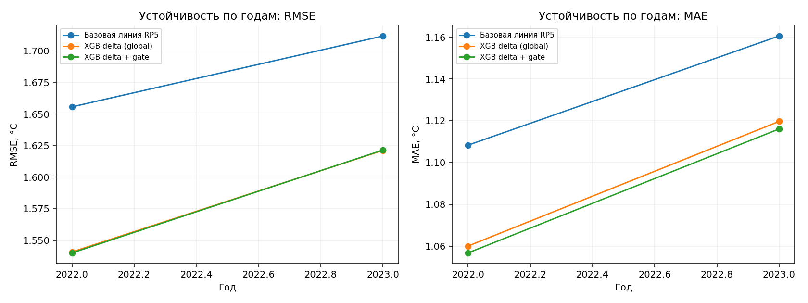
    </td>
    <td align="center" width="50%">
      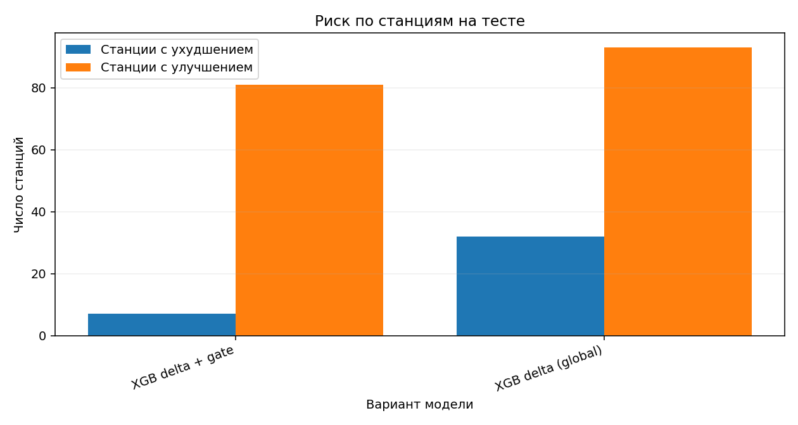
    </td>
  </tr>
</table>

Рис. 11. Слева: RMSE/MAE по годам test; справа: число улучшенных/ухудшенных станций по вариантам.

### 8.C Расширение overlap и переносимость (`8.17-8.22`)

### 8.17 Контрольная линия v2 (`selected125`)

Скрипт: `transfer/rp5_hydromet_bridge_improvements.py`  
Run: `outputs_runs/20260412_125500_bridge_control_selected125_v2`

Зафиксированный профиль:

- `xgb_delta_gated`
- `gate_eps=0.005`
- `conformal_station_groups=4`
- `conformal_min_group_month_samples=10`
- split: `train<=2020`, `calib=2021`, `test=2022-2023`

Результат на test (`n=90806`, `125` станций):

- baseline: `RMSE=1.6840`, `MAE=1.1344`, `R2=0.9882`
- `xgb_delta_gated`: `RMSE=1.5813`, `MAE=1.0864`, `R2=0.9896`
- выигрыш к baseline: `RMSE -0.1027`, `MAE -0.0480`

### 8.18 Пересборка overlap и policy-наборы (`2013-2023 + min10`)

Скрипты:

- `transfer/build_rp5_hydromet_overlap.py`
- `transfer/build_overlap_policy_sets.py`

Артефакты:

- `data/rosgidromet/bridge_inputs/rp5_meteostat_vs_hydromet_overlap_2013_2023_rebuilt_by_builder.csv`
- `data/rosgidromet/bridge_inputs/rp5_meteostat_overlap_policy_sets_2013_2023_min10.summary.json`
- `data/rosgidromet/bridge_inputs/rp5_meteostat_vs_hydromet_overlap_expanded_min10_2013_2023.csv`
- `data/rosgidromet/bridge_inputs/rp5_meteostat_vs_hydromet_overlap_control_selected125_2013_2023.csv`

Факты:

- rebuilt overlap: `467007` строк, `132` станции, окно `2013-01-01...2023-12-31`
- policy `expanded_min10_2013_2023`: `132` станции
- policy `control_selected125_2013_2023`: `462851` строк, `125` станций

### 8.19 Честная перепроверка: control vs expanded

Скрипт: `transfer/compile_bridge_control_vs_expanded_report.py`  
Отчёт: `outputs_runs/20260412_141200_bridge_control_vs_expanded_report.csv`

Использованные run:

- control: `outputs_runs/20260412_125500_bridge_control_selected125_v2`
- expanded: `outputs_runs/20260412_130500_bridge_expanded_min10_v2`

Сравнение `xgb_delta_gated` на test:

- control (`125` станций): `RMSE=1.5813`, `MAE=1.0864`, `R2=0.9896`
- expanded (`132` станции): `RMSE=1.6261`, `MAE=1.0969`, `R2=0.9890`
- в обоих наборах `xgb_delta_gated` лучше baseline по RMSE и MAE

<table align="center">
  <tr>
    <td align="center" width="50%">
      
    </td>
    <td align="center" width="50%">
      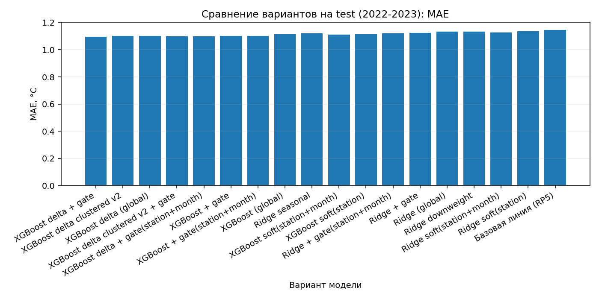
    </td>
  </tr>
</table>

Рис. 12. Слева: RMSE по вариантам на expanded test; справа: MAE по вариантам на expanded test.

### 8.20 Cluster bridge v2 + устойчивость (expanded)

Run: `outputs_runs/20260412_130500_bridge_expanded_min10_v2`

Cluster v2 (seasonal+bias профиль станции):

- `xgb_delta_clustered_v2`: `RMSE=1.6262`, `MAE=1.1015`
- `xgb_delta_clustered_v2_gated`: `RMSE=1.6271`, `MAE=1.0989`
- `xgb_delta_gated`: `RMSE=1.6261`, `MAE=1.0969` (лучше по MAE и не хуже по RMSE)

Rolling-origin (`rolling_origin_summary.csv`):

- 2019 -> 2020: `RMSE gain +0.1101`, `MAE gain +0.0501`
- 2020 -> 2021: `RMSE gain +0.0649`, `MAE gain +0.0369`
- 2021 -> 2022: `RMSE gain +0.1010`, `MAE gain +0.0472`
- 2022 -> 2023: `RMSE gain +0.0874`, `MAE gain +0.0447`

LOSO (`loso_summary.csv`, `132/132` станций):

- mean gain: `RMSE +0.0038`, `MAE +0.0006`
- ухудшение MAE на `53/132` станциях, ухудшение RMSE на `48/132`
- хвост риска остаётся station-specific и требует safeguard-политики для сложных станций

Safeguard-анализ (`safeguard_summary.json`):

- файл: `outputs_runs/20260412_130500_bridge_expanded_min10_v2/safeguard_summary.json`
- “тяжёлые” станции для `xgb_delta_global` (ухудшение к baseline): `37`
- восстановлено gating-веткой (`xgb_delta_gated`): `30`
- осталось ухудшенных после gating: `7`

### 8.21 Перенос на Волгоград (`zero-shot / finetune / scratch`)

Скрипты:

- `transfer/xgb_transfer_experiment.py`
- `transfer/build_transfer_modes_summary.py`

Run: `outputs_runs/20260412_141500_transfer_volgograd_v2`

Артефакты:

- `outputs_runs/20260412_141500_transfer_volgograd_v2/transfer_modes_summary.csv`
- `outputs_runs/20260412_141500_transfer_volgograd_v2/transfer_modes_vs_zeroshot.csv`

Результат на test (`n=8741`):

- zero-shot: `RMSE=1.2095`, `MAE=0.9194`, `R2=0.9884`
- finetune: `RMSE=0.8807`, `MAE=0.6707`, `R2=0.9938`
- scratch: `RMSE=0.8358`, `MAE=0.6323`, `R2=0.9945`

Выигрыш к zero-shot:

- finetune: `RMSE +0.3288`, `MAE +0.2486`, `R2 +0.00546`
- scratch: `RMSE +0.3737`, `MAE +0.2871`, `R2 +0.00607`

### 8.22 Фактический итог этапа 8

- Эталон `xgb_delta_gated + gate_eps=0.005 + conformal(4,10)` подтверждён на control и сохраняет выигрыш на expanded.
- Расширение overlap до `132` станций не сломало профиль: модель остаётся лучше baseline RP5 по RMSE/MAE.
- Cluster v2 в текущей реализации не дал устойчивого превосходства над `xgb_delta_gated`.
- По rolling-origin выигрыши стабильные, по LOSO остаётся station-tail риска.
- На переносе в Волгоград выполнено честное сравнение трёх режимов; лучший результат дал `scratch`, затем `finetune`, затем `zero-shot`.

### 8.D Adaptive gate + safeguard + cluster v3 (`8.23-8.27`)

### 8.23 Расширенный run v3 (adaptive/safeguard/cluster v3)

Скрипт: `transfer/rp5_hydromet_bridge_improvements.py`  
Run: `outputs_runs/20260412_170500_bridge_expanded_min10_v3_adaptive`

Сплит и набор:

- `train<=2020`, `calib=2021`, `test=2022-2023`
- `expanded_min10_2013_2023`: `467007` строк, `132` станции
- диагностика устойчивости в run: `rolling-origin` + `LOSO` (`132/132`)

### 8.24 Adaptive gate по station-risk (LOSO/rolling)

Что добавлено:

- station-wise `adaptive_eps` на базе `LOSO + rolling` риска
- базовый порог `base_eps=0.005`, дальше авто-подстройка по станциям

Факты (`adaptive_gate_summary.json`):

- `adaptive_eps_mean=0.0098`, `adaptive_eps_median=0.0070`
- добавка из rolling-волатильности: `+0.0020`
- открытых станций по gate: `89 -> 85`

Эффект на test:

- `xgb_delta_gated`: `RMSE=1.6261`, `MAE=1.0969`
- `xgb_delta_gated_adaptive`: `RMSE=1.6272`, `MAE=1.0975`
- по station-risk хвост стал мягче: ухудшенных станций `7 -> 5`

Вывод: adaptive gate в одиночку в первую очередь режет риск-хвост, но слегка «пережимает» глобальную ошибку.

### 8.25 Safeguard-контур для тяжёлых станций

Что добавлено:

- отдельная fallback-политика (`baseline/seasonal`) при ухудшении на calib
- порог срабатывания safeguard: `margin=0.002`

Факты (`safeguard_summary.json`):

- fallback включён на `82/132` станциях
- fallback на `baseline`: `43`
- fallback на `seasonal`: `39`

Эффект на test:

- `xgb_delta_gated_adaptive_safeguard`: `RMSE=1.6201`, `MAE=1.0953`, `R2=0.9890`
- к `xgb_delta_gated`: `RMSE -0.0060`, `MAE -0.0016`
- к baseline RP5: `RMSE -0.1052` (`-6.10%`), `MAE -0.0491` (`-4.29%`)

По station-risk:

- `xgb_delta_gated`: улучшено `82`, ухудшено `7`
- `xgb_delta_gated_adaptive_safeguard`: улучшено `83`, ухудшено `6`

<table align="center">
  <tr>
    <td align="center" width="50%">
      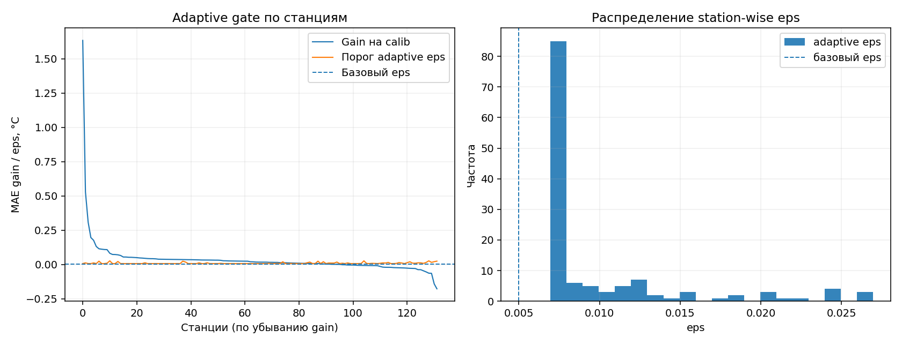
    </td>
    <td align="center" width="50%">
      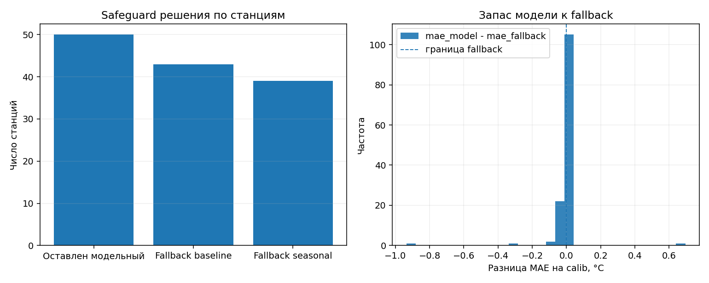
    </td>
  </tr>
</table>

Рис. 13. Слева: adaptive-пороги по станциям; справа: распределение fallback-политики safeguard.

  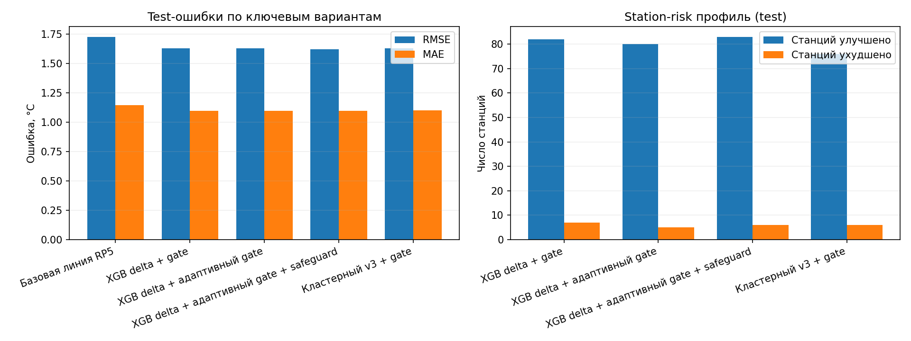

Рис. 14. Сравнение ключевых вариантов: ошибки на test и station-risk профиль.

### 8.26 Cluster bridge v3 (seasonal+bias+year-profile)

Что добавлено в v3-кластеризацию:

- seasonal+bias признаки станции
- профиль ошибок по годам/режимам (`mae_year_mean/std/max`, `bias_year_std`, mode-wise gain)

Факты (`cluster_fit_status_v3.csv`):

- кластеры `0/1/2`: обучены
- кластеры `3/4`: fallback на global-модель (мало train-строк)
- итого: `3` обученных + `2` fallback кластера

Эффект на test:

- `xgb_delta_clustered_v3_gated`: `RMSE=1.6265`, `MAE=1.0992`
- `xgb_delta_gated`: `RMSE=1.6261`, `MAE=1.0969`

Вывод: cluster v3 в текущей реализации не обошёл эталон по RMSE/MAE, оставлен как диагностическая ветка.

### 8.27 Uncertainty-блок: coverage + width + CRPS-like

Артефакты:

- `intervals_quality_summary.csv`
- `intervals_quality_tradeoff_085.png`

Сравнение при target `0.85`:

| Метод | Coverage | Mean width | CRPS-like |
|---|---:|---:|---:|
| global quantile | 0.8593 | 4.2000 | 0.5011 |
| monthly conformal | 0.8567 | 4.2603 | 0.4835 |
| conditional (`station_group + month`) | 0.8581 | 4.2380 | 0.4521 |

Вывод: conditional conformal сохраняет нужное покрытие и даёт лучшую quality-метрику интервала (`CRPS-like` минимум).

  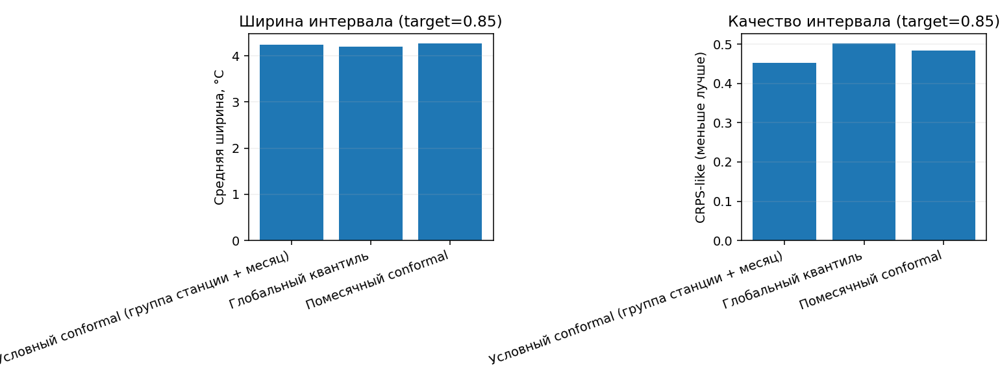

Рис. 15. Качество интервалов при target=0.85: сравнение ширины и CRPS-like по методам.

---
