## 1. Исходные данные

- Период: `2013-2023`
- Объём: `208278` строк
- Станций: `52`
- Наблюдений с известной `T`: `56238`
- Целевая: `T`
- Основные источники: ERA5 (`Temperature_2m`, `Dewpoint_2m`, `Surface_pressure`, `Evaporation`, `Total_precipitation`) + MODIS (`LST_Day`, `LST_Night`)

Пропуски:

- `T`: `73.00%`
- `LST_Day`: `61.18%`
- `LST_Night`: `59.90%`
- ERA5-признаки: `12.33%`

  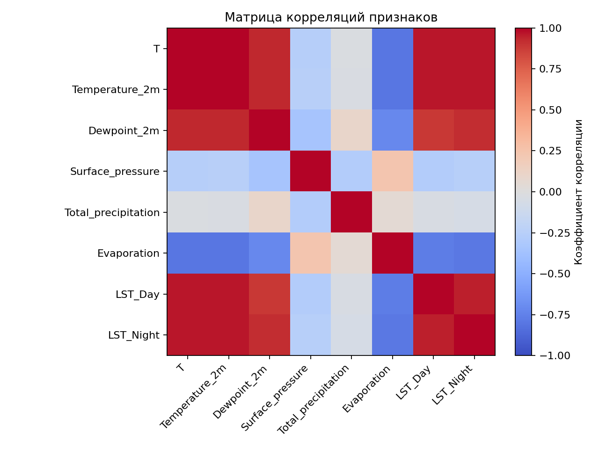

  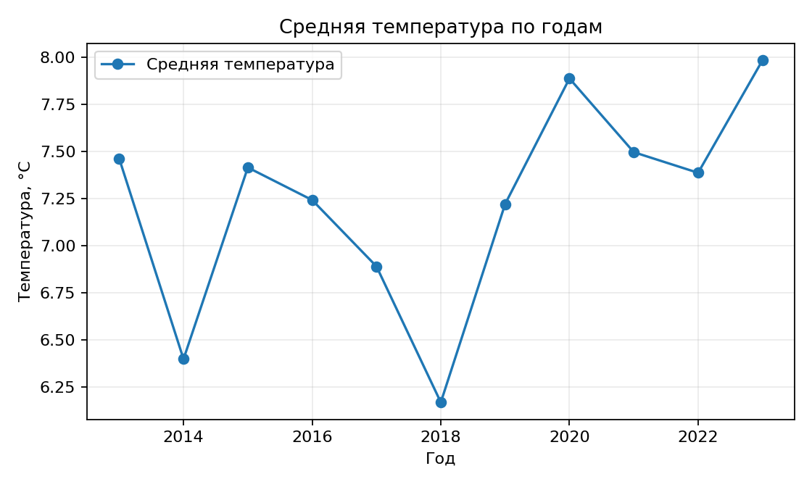
  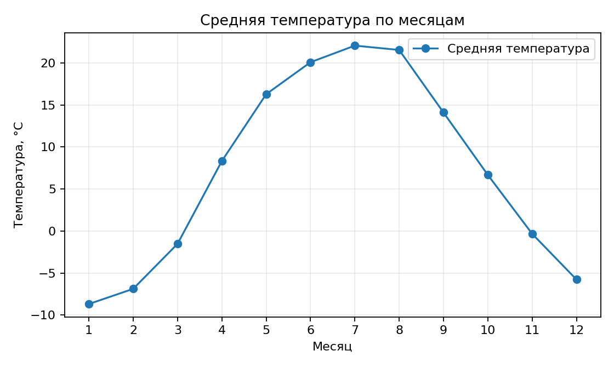

Итог этапа: сильнейший базовый сигнал идёт от `Temperature_2m`, но основной прирост качества фиксируется только после добавления календарных, лаговых и пространственных признаков.

---

## 2. Подтверждённая траектория улучшений

Метрики test (`2022-2023`):

| Этап | Скрипт / Run | R2 | RMSE | MAE |
|---|---|---:|---:|---:|
| Базовый timesplit | `xgb/xgb_optuna_timesplit.py` / `20250905_142927` | 0.9684 | 2.0564 | 0.9750 |
| Extra-features v2 | `xgb/xgb_optuna_with_extra_features_v2.py` / `20250915_165542_extra_v2` | 0.9868 | 1.3300 | 0.8482 |
| Лаги `t-1` | `xgb/xgb_optuna_with_lags.py` / `20250916_154740_lags` | 0.9875 | 1.2945 | 0.7963 |
| Лаги `t-1..t-3` | `xgb/xgb_optuna_with_lags123.py` / `20250916_163343_lags123_fix` | 0.9896 | 1.1816 | 0.7452 |
| Лаги `t-1..t-3` + spatial | `xgb/xgb_optuna_with_lags123_spatial.py` / `20250916_171729_lags123_spatial` | 0.9898 | 1.1675 | 0.7189 |

Итог этапа: подтверждённый путь улучшения был линейным и понятным: сезонные/производные признаки дали основной скачок от базового timesplit, лаговый блок ещё снизил ошибку, spatial-блок и `station_train_mean_T` довели ветку до лучшего результата на полном датасете.

---

## 3. Лучшая рабочая база

Скрипт: `xgb/xgb_optuna_with_lags123_spatial.py`  
Run: `outputs_runs/20250916_171729_lags123_spatial`

Что закрепилось как рабочая база:

- лаги `t-1, t-2, t-3` по `Temperature_2m`, `Dewpoint_2m`, `LST_Day`, `LST_Night`
- календарные признаки `dayofyear`, `sin_doy`, `cos_doy`, `month`
- производные признаки `dewpoint_dep`, `diurnal_range`
- spatial-блок `sin/cos(lat, lon)` или его нормированная замена по координатам
- station-level признак `station_train_mean_T`
- всего в подтверждённом run используется `31` признак
- схема обучения: `train = 2013-2021`, `test = 2022-2023`
- внутренняя валидация для подбора гиперпараметров: `inner_train = 2013-2020`, `inner_val = 2021`
- подбор параметров: `Optuna + XGBoost + early stopping`, без обычной `k-fold`-кросс-валидации

Метрики test (`2022-2023`):

- `R2 = 0.9898`
- `RMSE = 1.1675`
- `MAE = 0.7189`
- `MedAE = 0.4992`

  
  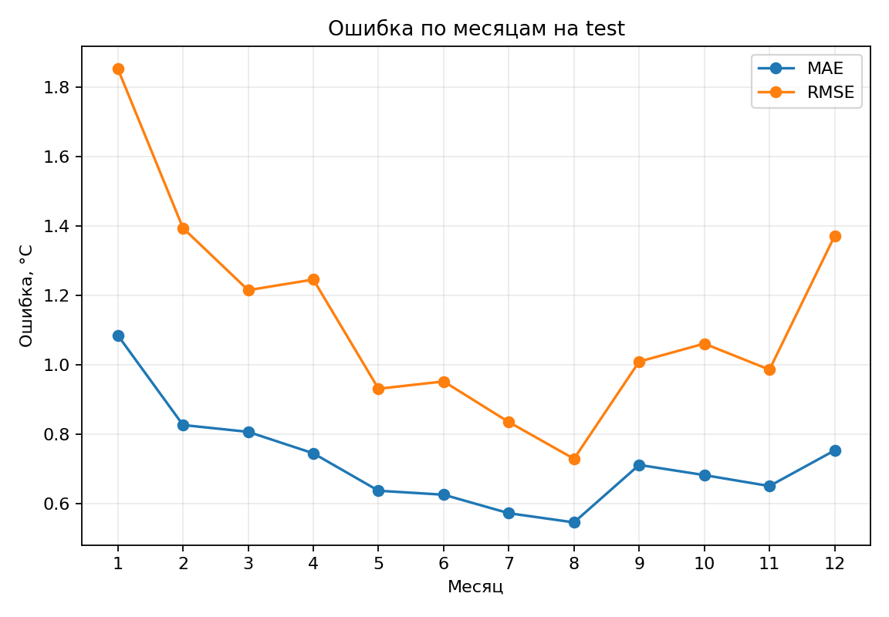

Итог этапа: именно ветка `lags123 + spatial` остаётся лучшей подтверждённой базой на полном наборе станций; более поздние прогоны её по сути диагностировали, но не превзошли.

---

## 4. Что не стало основной веткой

Сезонное разбиение (`xgb/xgb_optuna_with_extra_features_seasonal.py`, `20250915_094512_seasonal`):

- Cold: `R2 = 0.9450`, `RMSE = 1.5472`, `MAE = 0.9546`
- Warm: `R2 = 0.9708`, `RMSE = 1.1383`, `MAE = 0.7684`

Post-bias по станциям (`xgb/xgb_optuna_with_lags123_spatial_bias.py`, `20250916_173641_lags123_spatial_bias`):

- до коррекции: `R2 = 0.9897`, `RMSE = 1.1773`, `MAE = 0.7239`
- после коррекции: `R2 = 0.9897`, `RMSE = 1.1773`, `MAE = 0.7239`
- эффект на уровне шума, прироста относительно обычной `lags123_spatial` нет

Long-run и ансамбль (`xgb/xgb_optuna_with_lags123_spatial_longrun.py`, `xgb/xgb_optuna_with_lags123_spatial_longrun_ens5.py`):

- long-run: `R2 = 0.9893`, `RMSE = 1.1961`, `MAE = 0.7304`
- ens5: `R2 = 0.9894`, `RMSE = 1.1927`, `MAE = 0.7286`

Итог этапа: усложнение бустинга и post-bias-коррекция не дали выигрыша над обычной веткой `lags123_spatial`; основной прирост в проекте принесли именно признаки, а не дополнительная инженерия поверх уже обученной модели.

---

## 5. Подтверждённые слабые места

### 5.1 Зимний режим

База `lags123_spatial` по месяцам хуже всего работает в холодный сезон:

- январь: `MAE = 1.0841`
- февраль: `MAE = 0.8258`
- декабрь: `MAE = 0.7526`
- для сравнения, август: `MAE = 0.5451`

Отдельный зимний прогон (`xgb/xgb_optuna_winter_only.py`, `20250923_111926_winter_only`) это подтвердил:

- `R2 = 0.9514`
- `RMSE = 1.4540`
- `MAE = 0.8516`

### 5.2 Station-wise доменный сдвиг

Диагностический прогон `xgb/xgb_optuna_with_error_map.py` (`20250923_114911_error_map`) показал, что основная проблема сосредоточена не в среднем уровне ошибки, а в отдельных станциях:

- худшая станция на test: `35108`, `MAE = 2.5119`
- следующая группа по ухудшению: `35007`, `27857`, `27995`, `34289`

  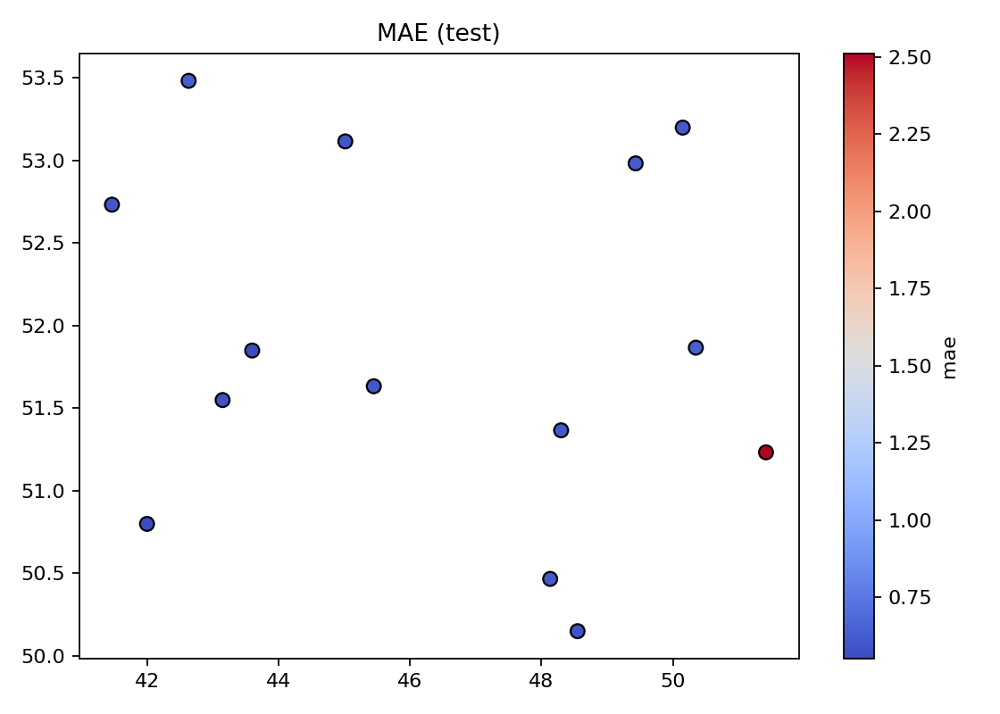

Проверка `xgb/xgb_optuna_with_lags123_spatial_exclude35108.py` это отдельно подтвердила:

- с `35108`: `R2 = 0.9894`, `RMSE = 1.1913`, `MAE = 0.7281`
- без `35108`: `R2 = 0.9954`, `RMSE = 0.7774`, `MAE = 0.5920`

Итог: станция `35108` даёт непропорционально большой вклад в хвост ошибки; это важная диагностика, но не новая базовая модель, потому что задача при исключении станции становится проще.

### 5.3 Остаточная временная структура

Скрипт: `xgb/xgb_optuna_with_resid_acf_pacf.py`  
Run: `outputs_runs/20250923_172831_resid_acf_pacf`

- `R2 = 0.9892`
- `RMSE = 1.2037`
- `MAE = 0.7343`
- Ljung-Box остаётся значимым на ряде станций, наиболее резко на `35108`

  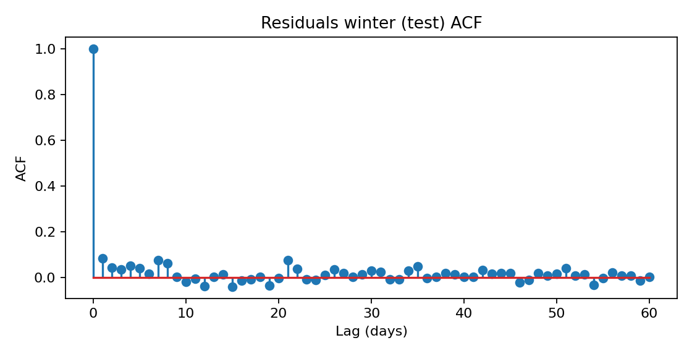

Итог этапа: при высоком среднем `R2` у модели всё ещё остаются недоубранные временные зависимости в остатках, особенно в зимнем режиме и на проблемных станциях.

---

## 6. Spatial Transfer Preflight

Скрипт: `transfer/spatial_transfer_preflight.py`  
Run: `outputs_runs/20260327_171818_spatial_transfer_preflight`

Постановка:

- `52` станции разделены на `west/east` по медиане долготы
- в каждой половине наблюдаемая `T` есть только у `7` станций
- режим `fewtrain` оставляет полный target-test, но в target-train сохраняет `T` только на `5` или `3` калибровочных станциях

Метрики test (`2022-2023`):

| Направление | Режим target-train | Лучший режим | R2 | RMSE | MAE |
|---|---|---:|---:|---:|
| `west -> east` | полный target-train | `scratch` | 0.9855 | 1.4800 | 0.8923 |
| `west -> east` | `5` станций | `finetune` | 0.9817 | 1.6579 | 0.9554 |
| `west -> east` | `3` станции | `scratch` | 0.9792 | 1.7695 | 1.0143 |
| `east -> west` | полный target-train | `scratch` | 0.9949 | 0.7713 | 0.5869 |
| `east -> west` | `5` станций | `scratch` | 0.9951 | 0.7614 | 0.5850 |
| `east -> west` | `3` станции | `scratch` | 0.9946 | 0.7958 | 0.6115 |

  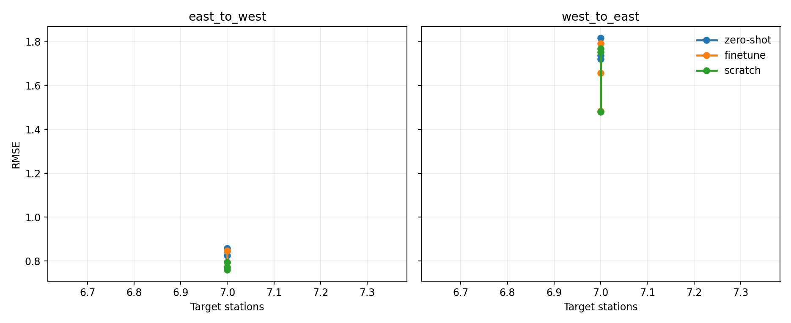

Итог этапа: переносимость оказалась выраженно асимметричной. Направление `west -> east` заметно сложнее `east -> west`, что согласуется с уже выявленными проблемами на восточном кластере станций. При `5` калибровочных станциях few-shot-адаптация ещё удерживает качество, но при `3` станциях деградация уже явная; `zero-shot` стабильно слабее, чем `finetune/scratch`, на сложной стороне.

---

## 7. Проверки устойчивости до следующего регионального шага

### 7.1 Winter transfer (мульти-сид)

Скрипт: `transfer/run_winter_transfer_multiseed.py`  
Run: `outputs_runs/20260407_161100_volgograd_winter_multiseed_full5`

Постановка:

- winter-only выборка (`11,12,1,2,3`)
- перенос `Saratov -> Volgograd`
- `5` сидов (`42/52/62/72/82`) в режимах `zero-shot`, `finetune`, `scratch`

Агрегированные test-метрики по сидам:

| Ветка | R2 mean ± std | RMSE mean ± std | MAE mean ± std | n |
|---|---:|---:|---:|---:|
| `scratch` | 0.9758 ± 0.0004 | 0.9360 ± 0.0086 | 0.6775 ± 0.0042 | 3624 |
| `finetune` | 0.9748 ± 0.0004 | 0.9561 ± 0.0082 | 0.6955 ± 0.0064 | 3624 |
| `zero-shot` | 0.9427 ± 0.0043 | 1.4409 ± 0.0544 | 1.0166 ± 0.0230 | 3624 |

  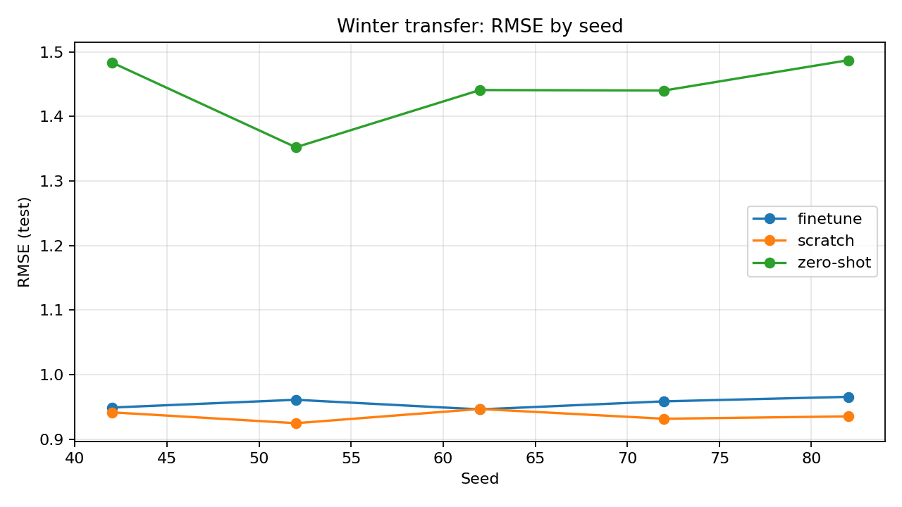

Итог этапа: зимний ranking устойчив по сидам и не меняет общий вывод transfer-ветки: `scratch` лучше `finetune`, `zero-shot` заметно слабее.

### 7.2 LOSO stress-test по станциям (Саратов)

Скрипт: `transfer/saratov_loso_stress.py`  
Run: `outputs_runs/20260407_160800_saratov_loso_full14`

Постановка:

- `leave-one-station-out` на всех `14` станциях с наблюдаемой `T` на test `2022-2023`
- обучение на остальных станциях тем же базовым feature-набором

Сводные метрики:

- `RMSE_mean = 1.0633`
- `RMSE_median = 0.8310`
- `MAE_mean = 0.8151`
- худшая станция: `35108`, `RMSE = 4.0368`
- лучшая станция: `34059`, `RMSE = 0.6927`

  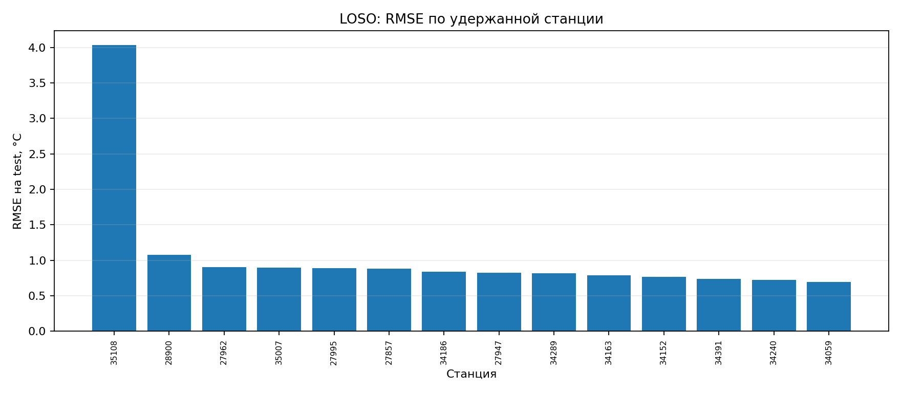

Итог этапа: station-wise неустойчивость подтверждена в более жёсткой постановке с unseen station; основной хвост ошибки остаётся на `35108`.

### 7.3 Интервалы неопределённости (P10/P50/P90)

Скрипт: `transfer/saratov_uncertainty_intervals.py`  
Run: `outputs_runs/20260407_161900_saratov_uncertainty_full_calibrated`

Сводные test-метрики интервалов:

- `coverage(P10,P90) = 0.7209`
- целевой coverage: `0.80`
- `coverage_gap = -0.0791`
- средняя ширина интервала: `2.0423`
- `P50`: `MAE = 0.7093`, `RMSE = 1.1380`

  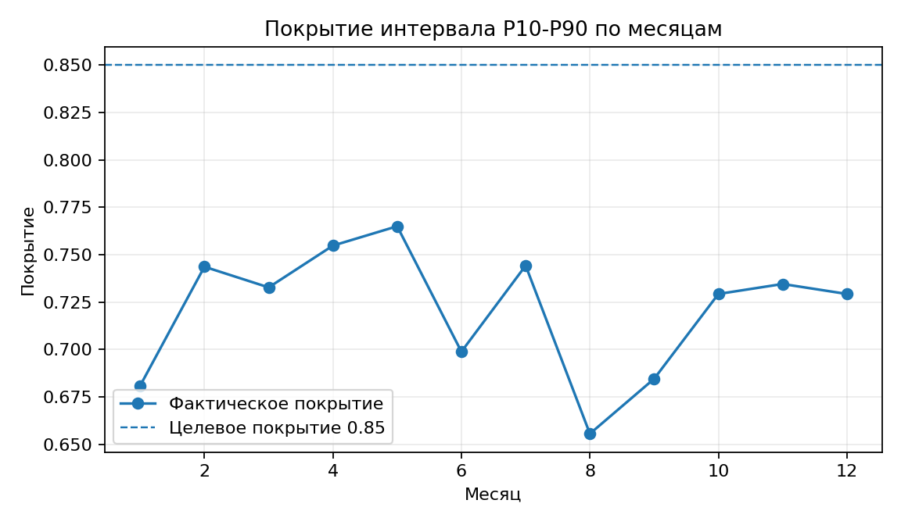
  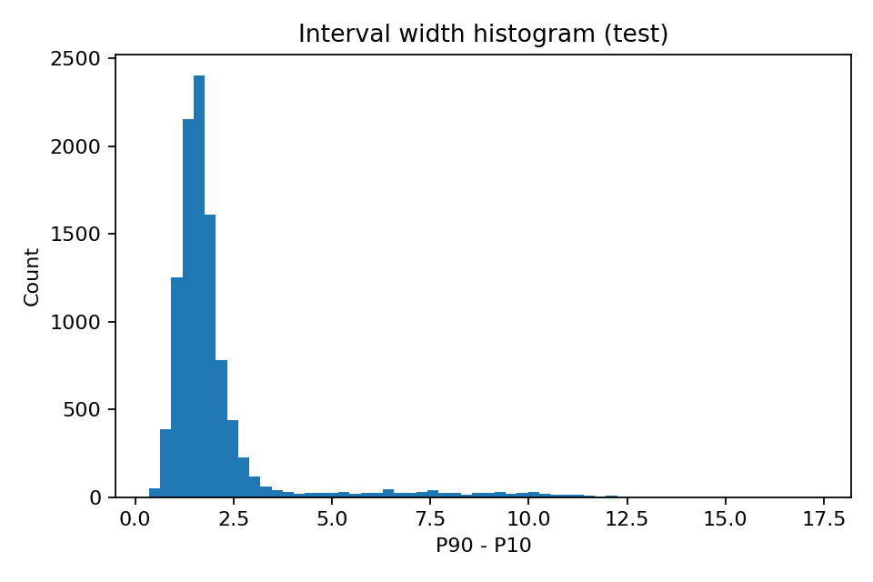

Итог этапа: интервалы пока недокрывают фактическую неопределённость (coverage ниже цели), особенно по отдельным месяцам.

### 7.4 Winter hybrid (full + winter specialist)

Скрипт: `transfer/saratov_winter_hybrid_experiment.py`  
Run: `outputs_runs/20260407_163025_saratov_winter_hybrid`

Постановка:

- базовая full-year модель обучается на `2013-2021` и тестируется на `2022-2023`
- отдельная winter-only модель обучается только на месяцах `11,12,1,2,3`
- в hybrid-прогнозе значения для зимних месяцев берутся из winter-only модели, остальные месяцы остаются из full-year модели

Сравнение на test:

| Срез | База (full) | Hybrid (full+winter) |
|---|---:|---:|
| `RMSE` (полный test) | 1.1450 | 1.1553 |
| `MAE` (полный test) | 0.7094 | 0.7148 |
| `RMSE` (winter) | 1.3588 | 1.3796 |
| `MAE` (winter) | 0.8065 | 0.8197 |

  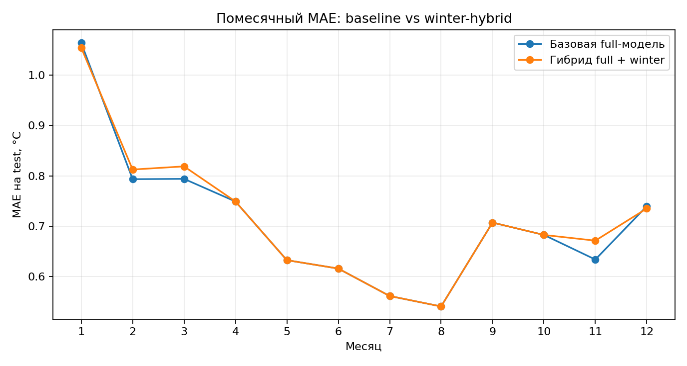

Итог этапа: раздельная winter-ветка в текущей реализации не улучшила качество ни на зимнем срезе, ни на полном test; базовая full-year модель остаётся сильнее.

### 7.5 Winter weight scan (одна модель, взвешивание зимы)

Скрипт: `transfer/saratov_winter_weight_scan.py`  
Run: `outputs_runs/20260407_163846_saratov_winter_weight_scan`

Постановка:

- обучалась одна full-year модель на `2013-2021`
- зимним наблюдениям (`11,12,1,2,3`) в train назначался вес `factor`
- проверены `factor = 1.0 / 1.15 / 1.3 / 1.5 / 1.8 / 2.2`

Ключевые результаты (`2022-2023`):

- baseline `factor=1.0`: `RMSE_full=1.1450`, `MAE_full=0.7094`, `RMSE_winter=1.3588`, `MAE_winter=0.8065`
- лучший по full-RMSE (`factor=1.3`): `RMSE_full=1.1450`, `MAE_full=0.7066`, `RMSE_winter=1.3574`, `MAE_winter=0.8008`
- лучший по winter-RMSE (`factor=1.5`): `RMSE_full=1.1457`, `MAE_full=0.7083`, `RMSE_winter=1.3565`, `MAE_winter=0.8031`

  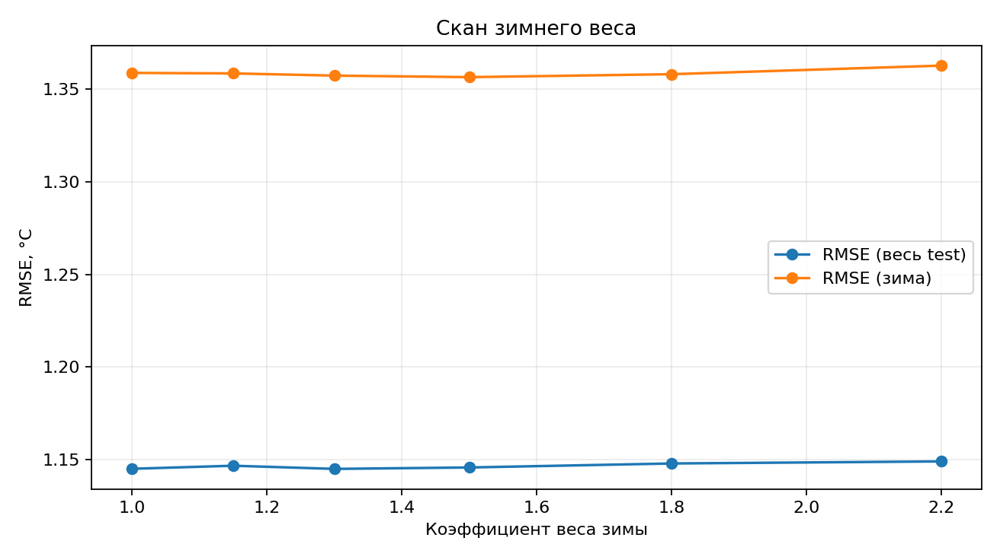

Итог этапа: умеренное взвешивание зимних месяцев (`factor ~ 1.3-1.5`) даёт небольшой, но реальный прирост на зимнем срезе без заметной потери общего качества.

### 7.6 Winter transfer (мульти-сид x10, усиленный прогон)

Скрипт: `transfer/run_winter_transfer_multiseed.py`  
Run: `outputs_runs/20260407_164430_volgograd_winter_multiseed_x10`

Постановка:

- winter-only выборка (`11,12,1,2,3`)
- перенос `Saratov -> Volgograd`
- `10` сидов (`42..132`) в режимах `zero-shot`, `finetune`, `scratch`
- усиленные настройки: `n_trials=25`, `num_boost_round=3500`

Агрегированные test-метрики по сидам:

| Ветка | R2 mean ± std | RMSE mean ± std | MAE mean ± std | n |
|---|---:|---:|---:|---:|
| `scratch` | 0.9761 ± 0.0002 | 0.9317 ± 0.0039 | 0.6757 ± 0.0025 | 3624 |
| `finetune` | 0.9751 ± 0.0005 | 0.9507 ± 0.0092 | 0.6915 ± 0.0076 | 3624 |
| `zero-shot` | 0.9442 ± 0.0037 | 1.4220 ± 0.0480 | 1.0027 ± 0.0267 | 3624 |

  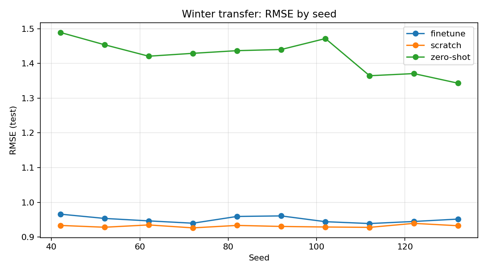

Итог этапа: при увеличении числа сидов и более тяжёлом тюнинге ranking не изменился; `scratch` стабильно лучший, `finetune` второй, `zero-shot` заметно слабее.

### 7.7 Spatial preflight (усиленный прогон)

Скрипт: `transfer/spatial_transfer_preflight.py`  
Run: `outputs_runs/20260407_164430_spatial_transfer_preflight_serious_fix`

Постановка:

- проверка пространственного переноса в двух направлениях: `east->west` и `west->east`
- режимы калибровки: `all`, `fewtrain05`, `fewtrain03`
- настройки: `n_trials=18`, `num_boost_round=3000`, `zero_inflated_precip=True`

Метрики `scratch` по кейсам:

| Направление | Режим | R2 | RMSE | MAE | n |
|---|---|---:|---:|---:|---:|
| `east->west` | `all` | 0.9950 | 0.7680 | 0.5845 | 5110 |
| `east->west` | `fewtrain05` | 0.9949 | 0.7758 | 0.5925 | 5110 |
| `east->west` | `fewtrain03` | 0.9945 | 0.7993 | 0.6138 | 5110 |
| `west->east` | `all` | 0.9860 | 1.4536 | 0.8739 | 5110 |
| `west->east` | `fewtrain05` | 0.9809 | 1.6941 | 0.9862 | 5110 |
| `west->east` | `fewtrain03` | 0.9798 | 1.7424 | 0.9997 | 5110 |

  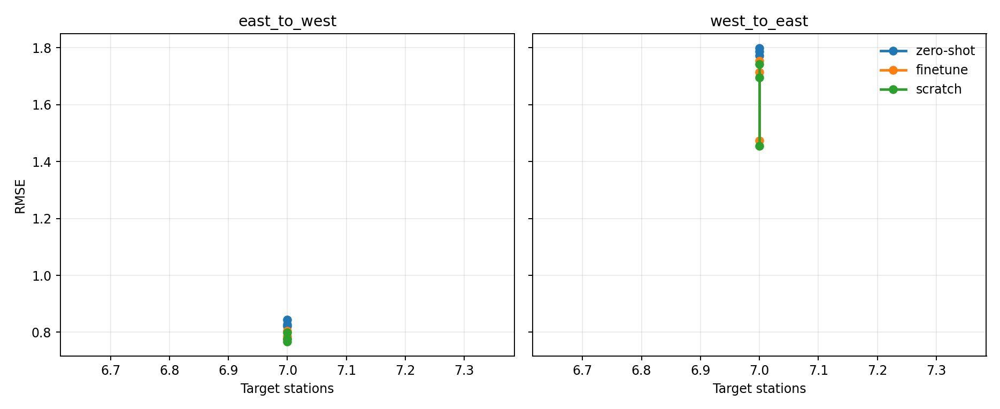

Итог этапа: асимметрия переноса подтверждена ещё раз; `east->west` остаётся существенно легче, `west->east` резко деградирует при сокращении калибровочных станций.

### 7.8 Интервалы неопределённости (strict rerun)

Скрипт: `transfer/saratov_uncertainty_intervals.py`  
Runs:

- `outputs_runs/20260407_164430_saratov_uncertainty_cov80_strict`
- `outputs_runs/20260407_164430_saratov_uncertainty_cov85_strict`

Сводка test-метрик:

| Run | target coverage | coverage(P10,P90) | coverage gap | width mean | P50 RMSE | P50 MAE |
|---|---:|---:|---:|---:|---:|---:|
| `cov80_strict` | 0.80 | 0.6210 | -0.1790 | 1.6837 | 1.1762 | 0.7253 |
| `cov85_strict` | 0.85 | 0.7047 | -0.1453 | 1.9469 | 1.1414 | 0.7084 |

  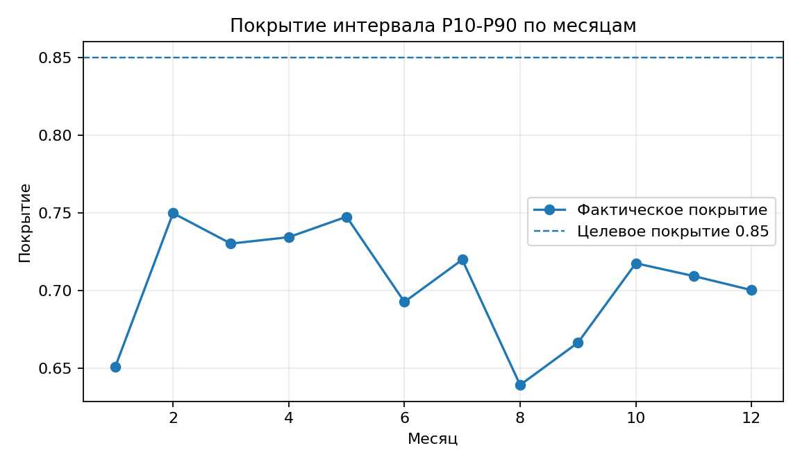
  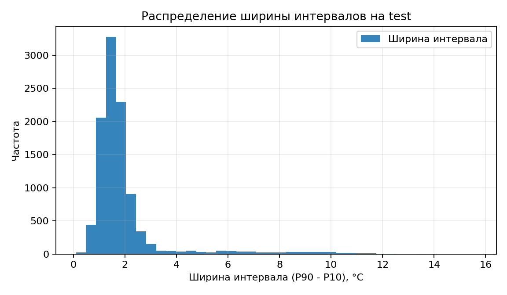

Итог этапа: даже в усиленном прогоне интервалы остаются недокалиброванными (coverage ниже цели); рост целевого уровня с `0.80` до `0.85` расширяет интервал и улучшает фактическое покрытие, но разрыв сохраняется.

### 7.9 Holdout conformal-калибровка интервалов

Скрипт: `transfer/saratov_uncertainty_intervals.py`  
Runs:

- `outputs_runs/20260407_184200_saratov_uncertainty_cov80_conformal_holdout`
- `outputs_runs/20260407_184700_saratov_uncertainty_cov85_conformal_holdout`

Что изменено в постановке:

- для conformal-калибровки убрана утечка по валидации
- tuning: `2013-2019`, tune-val: `2020`
- fit: `2013-2020`
- calibration holdout: `2021`
- метод: `calibration_method=conformal_monthly`

Сводка test-метрик:

| Run | target coverage | coverage(P10,P90) | coverage gap | coverage gain | width mean | P50 RMSE | P50 MAE |
|---|---:|---:|---:|---:|---:|---:|---:|
| `cov80_conformal_holdout` | 0.80 | 0.8068 | +0.0068 | +0.1161 | 2.4230 | 1.2207 | 0.7325 |
| `cov85_conformal_holdout` | 0.85 | 0.8633 | +0.0133 | +0.1953 | 2.7139 | 1.2451 | 0.7426 |

  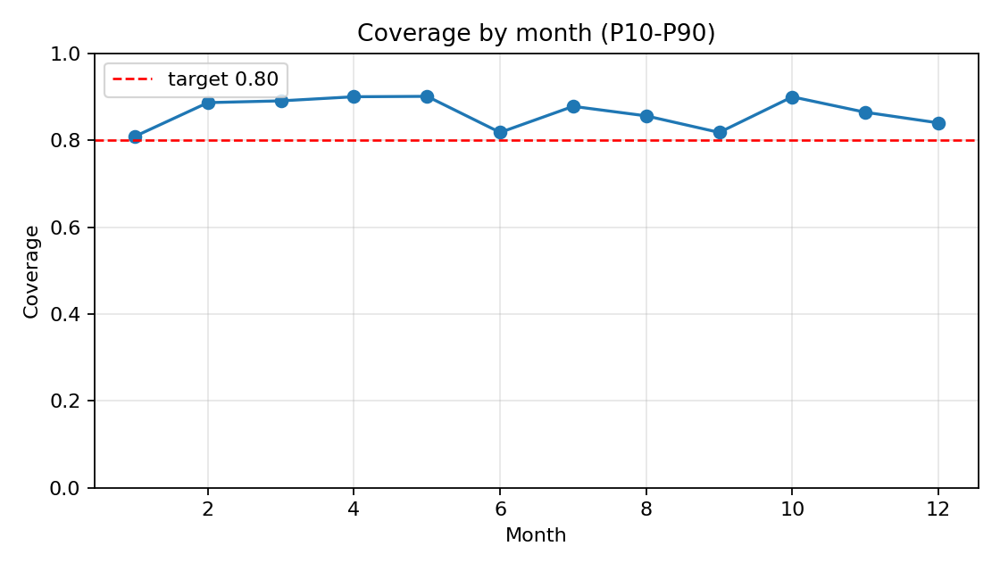
  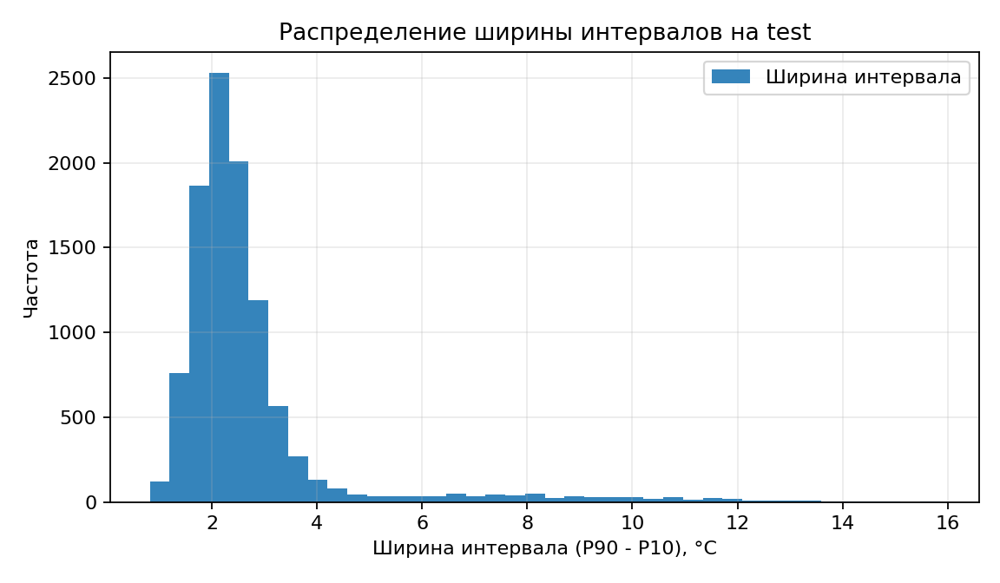

Итог этапа: holdout-conformal калибровка закрыла целевой coverage для обоих уровней (`0.80` и `0.85`), но ценой ожидаемого расширения интервалов и небольшого ухудшения центрального прогноза `P50`.

### 7.10 West->East: post-bias correction

Скрипты: `transfer/xgb_transfer_experiment.py`, `transfer/spatial_transfer_preflight.py`  
Run: `outputs_runs/20260407_185400_spatial_transfer_w2e_bias`

Постановка:

- только сложное направление `west -> east`
- режимы `all`, `fewtrain05`, `fewtrain03`
- включена `post-bias-correction` по residual на `target-train`
- в summary добавлены пары `mode` и `mode+bias`

Ключевой эффект по RMSE (test):

- `all`: `zero-shot 1.7908 -> 1.7822`, `scratch 1.4689 -> 1.4689`, `finetune 1.4906 -> 1.4906`
- `fewtrain05`: `zero-shot 1.7808 -> 1.7682`, `scratch 1.6741 -> 1.6741`, `finetune 1.6894 -> 1.6893`
- `fewtrain03`: `zero-shot 1.7609 -> 1.7517`, `scratch 1.7740 -> 1.7741`, `finetune 1.6989 -> 1.6990`

  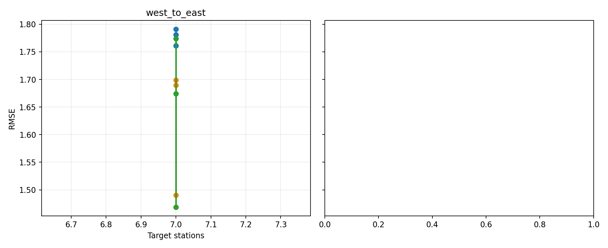

Итог этапа: station-bias correction даёт заметный плюс только для `zero-shot`; для `scratch/finetune` эффект близок к нулю и местами отрицательный.

---

## 8. Волгоград: перенос на второй регион

Скрипты: `transfer/build_volgograd_*.py`, `transfer/xgb_transfer_experiment.py`, `transfer/wait_and_run_volgograd_suite.py`  
Run: `outputs_runs/20260327_203205_volgograd_transfer_suite`

Сборка target-dataset:

- исходный target собран за `2013-2023` по `13` станциям
- после склейки `Meteostat + ERA5 + MODIS` финальный CSV содержит `34700` строк и `12` станций: `data/volgograd/processed/volgograd_final_2013_2023_T_ERA5_LST_daynight.csv`
- одна станция выпала из финального merge из-за отсутствия пригодного `MODIS`-покрытия

Постановка transfer:

- transfer-пайплайн вынесен в `transfer/pipeline_common.py` и `transfer/xgb_transfer_experiment.py`
- по признакам это продолжение лучшей саратовской ветки `lags123_spatial`: календарные, производные, spatial и лаги `t-1..t-3`
- это не прямой запуск `xgb/xgb_optuna_with_lags123_spatial.py`, а общий вариант той же логики для межрегионального переноса
- схема обучения и валидации та же, что в саратовской базе: `train = 2013-2021`, `test = 2022-2023`, внутренняя валидация на `2021`
- `zero-shot`: обучение на саратовском датасете и прямое применение к Волгограду без переобучения
- `finetune`: старт из саратовской модели с последующей адаптацией на Волгограде
- `scratch`: обучение на Волгограде с нуля без переноса весов
- для `zero-shot/finetune` используется общий для двух регионов набор признаков без `station_train_mean_T`
- для `scratch` используется полный target-набор признаков, включая `station_train_mean_T`
- `full`: в target-train доступны все волгоградские станции с наблюдаемой `T`
- `fewshot_5` и `fewshot_3`: в target-train оставлены только `5` или `3` калибровочные станции
- калибровочные станции: станции нового региона, по которым модель видит реальную `T` и может подстроиться под локальное смещение
- три прогона нужны, чтобы отдельно проверить полный перенос, перенос при малом числе станций и нижнюю границу few-shot-адаптации

Метрики test:

| Режим target-train | Ветка | R2 | RMSE | MAE | MedAE | n |
|---|---|---:|---:|---:|---:|---:|
| `full` | `zero-shot` | 0.9861 | 1.3216 | 1.0186 | 0.8103 | 8741 |
| `full` | `finetune` | 0.9941 | 0.8621 | 0.6539 | 0.5148 | 8741 |
| `full` | `scratch` | 0.9944 | 0.8367 | 0.6353 | 0.5015 | 8741 |
| `fewshot_5` | `zero-shot` | 0.9844 | 1.3941 | 1.0377 | 0.7973 | 3642 |
| `fewshot_5` | `finetune` | 0.9929 | 0.9401 | 0.7121 | 0.5659 | 3642 |
| `fewshot_5` | `scratch` | 0.9935 | 0.8992 | 0.6895 | 0.5681 | 3642 |
| `fewshot_3` | `zero-shot` | 0.9856 | 1.3361 | 0.9790 | 0.7470 | 2186 |
| `fewshot_3` | `finetune` | 0.9936 | 0.8944 | 0.6827 | 0.5465 | 2186 |
| `fewshot_3` | `scratch` | 0.9946 | 0.8187 | 0.6263 | 0.4987 | 2186 |

  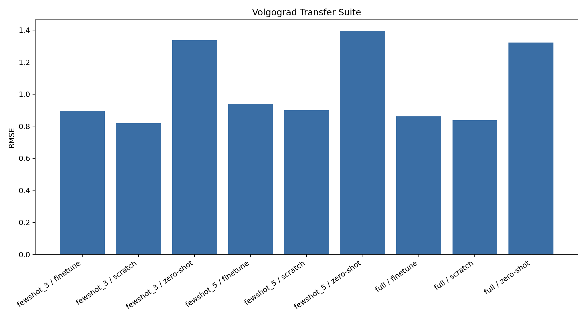

Рис. 1. RMSE по трём режимам переноса и трём вариантам target-train.

`full` как основное сравнение по второму региону:

<table align="center">
  <tr>
    <td align="center" width="50%">
      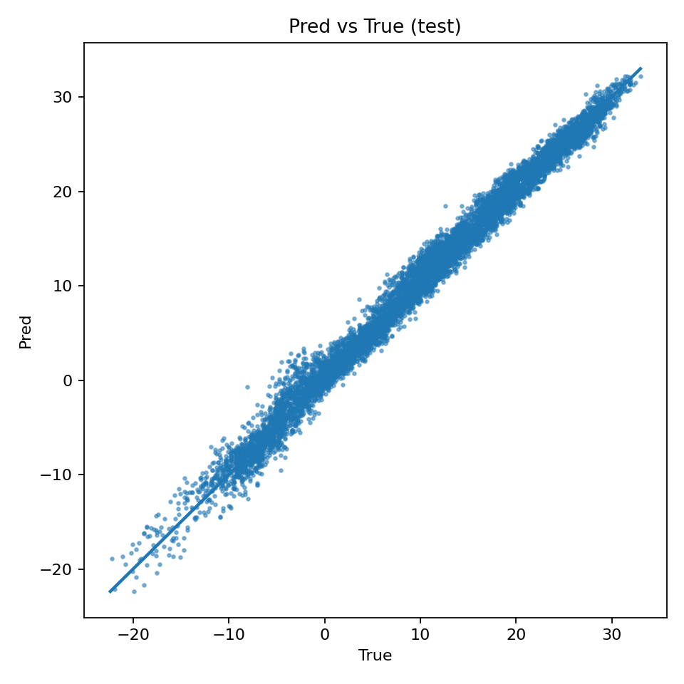
    </td>
    <td align="center" width="50%">
      
    </td>
  </tr>
</table>

Рис. 2. Слева `zero-shot`, справа `scratch`: зависимость прогноза от истинной температуры на test для `full`.

<table align="center">
  <tr>
    <td align="center" width="50%">
      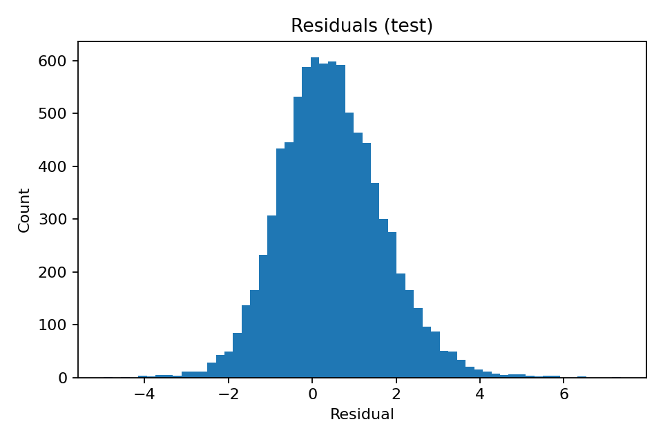
    </td>
    <td align="center" width="50%">
      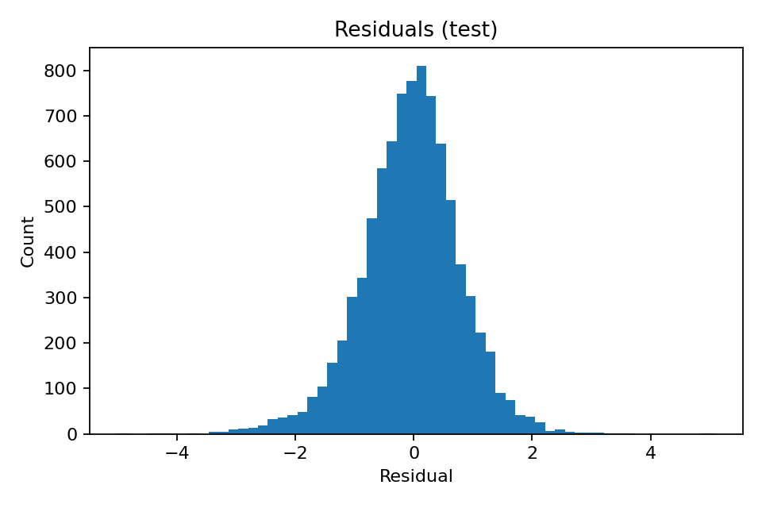
    </td>
  </tr>
</table>

Рис. 3. Слева `zero-shot`, справа `scratch`: распределение остатков на test для `full`.

Диагностика лучшей ветки `full / scratch`:

- худшие месяцы по `MAE`: январь `0.8214`, октябрь `0.7153`, март `0.7123`, апрель `0.6686`
- худшие станции по `MAE`: `34476` `0.7890`, `34363` `0.7380`, `34357` `0.7070`, `34240` `0.7018`

Итог этапа:

- перенос на второй регион подтверждён артефактами; даже `zero-shot` удерживает `R2 > 0.984` во всех трёх постановках
- во всех подтверждённых случаях лучшим оказался `scratch`, `finetune` стабильно второй, `zero-shot` заметно слабее
- `fewshot_3` нельзя трактовать как улучшение относительно `full`: это меньшая и более лёгкая подвыборка (`n = 2186` против `8741`)
- лучше всего перенеслась не готовая саратовская модель, а сама схема признаков и общий пайплайн
- при наличии локальных наблюдений для нового региона разумной базой пока остаётся `scratch` на том же наборе признаков
- результат подтверждает переносимость подхода, но сам по себе ещё не доказывает универсальность модели: пока проверен только один новый регион
