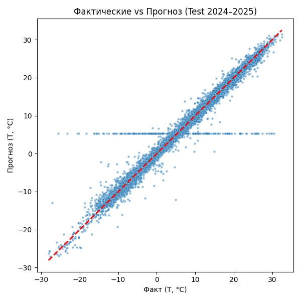
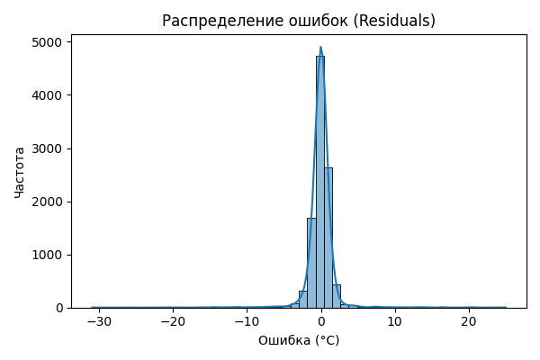
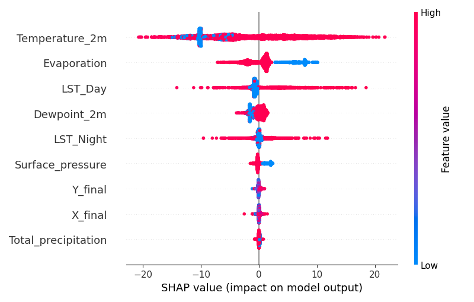
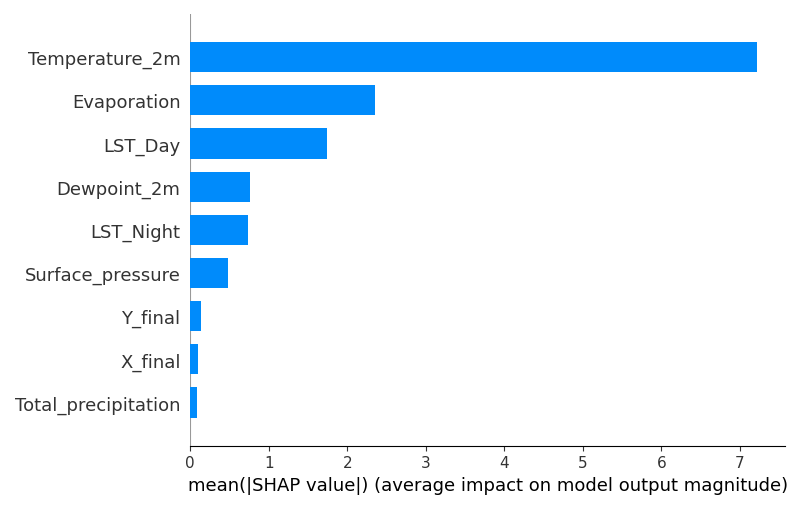
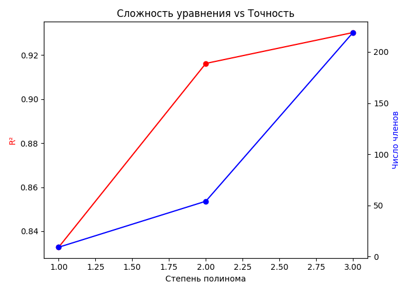
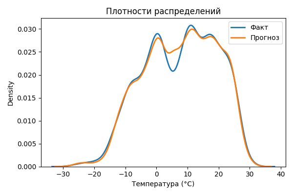
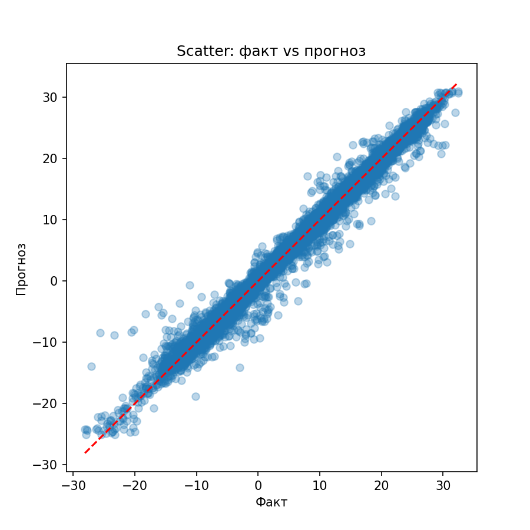
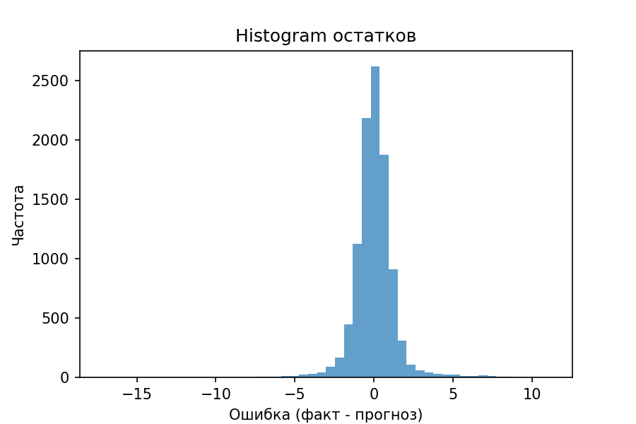
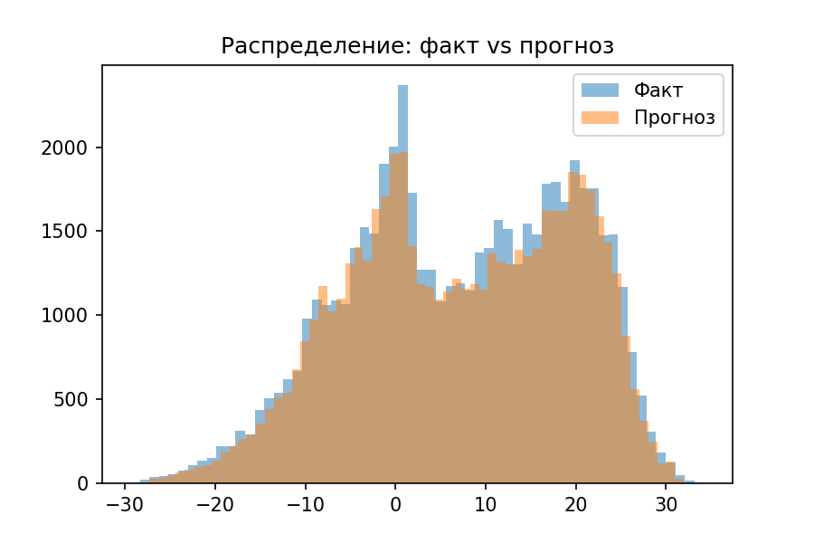

## 📂 Структура репозитория

- `eda.py` — разведочный анализ данных.  
- `xgb_optuna_timesplit.py` — подбор гиперпараметров XGBoost через Optuna.  
- `xgb_infer_full.py` — прогон лучшей модели на всём датасете.  
- `shap_analysis.py` — SHAP-анализ.  
- `poly_regression_compare.py` — сравнение линейных и полиномиальных аппроксимаций.  
- `linear_regression_all_features.py` — линейная модель на всех признаках.  
- `eda_plots/` — графики разведочного анализа.  
- `outputs_runs/` — результаты запусков моделей (метрики, графики, модели).  

---

## 🔹 1. Данные

- Период: **2013–2023**, ~208 тыс. строк.  
- Источники:  
  - ERA5: `Temperature_2m`, `Dewpoint_2m`, `Surface_pressure`, `Evaporation`, `Total_precipitation`  
  - MODIS: `LST_Day`, `LST_Night`  
  - Наземные наблюдения: `T`  
  - Координаты: `X_final`, `Y_final`

### Пропуски
- `T` — ~73%  
- MODIS (`LST_Day`, `LST_Night`) — ~60% (облачность)  
- ERA5 — ~12%  

---

## 🔹 2. Разведочный анализ данных (EDA)

Посмотрел распределения признаков и сезонные графики (см. [гистограммы](eda_plots/hist_Temperature_2m.png), [boxplots](eda_plots/boxplots.png), [сезонные тренды](eda_plots/temp_by_year.png), [по месяцам](eda_plots/temp_by_month.png)).  

Особое внимание **корреляциям**:

  

Как видно, `Temperature_2m` из ERA5 сильно коррелирует с целевой `T`. Однако и другие признаки (например, `Evaporation`, `LST_Day`, `Dewpoint_2m`) оказывают влияние, что подтвердилось на SHAP-анализе.

---

## 🔹 3. Учёт временного ряда

- **Обучение (train):** 2013–2021  
- **Тестирование (test):** 2022–2023  

  Внутри train для подбора гиперпараметров использовал кросс-валидацию.  

---

## 🔹 4. Обучение модели (XGBoost)

Для подбора гиперпараметров применил Optuna (500 испытаний). Обучение велось на GPU (`device=cuda`).  

### Метрики на тесте (2022–2023):
- R² = **0.9684**  
- RMSE = **2.06 °C**  
- MAE = **0.98 °C**  
- MedAE = **0.60 °C**  

  
  

---

## 🔹 5. Интерпретация модели (SHAP-анализ)

SHAP-анализ (3000 случайных точек) показал топ-5 признаков:

1. ERA5 `Temperature_2m`  
2. ERA5 `Evaporation`  
3. MODIS `LST_Day`  
4. ERA5 `Dewpoint_2m`  
5. MODIS `LST_Night`  

  
  

📌 Что видно на графиках:  
- Высокие значения `Temperature_2m` и `LST_Day` тянут предсказания вверх.  
- `Evaporation` вносит отрицательный вклад (физически логично вроде: сильное испарение часто связано с охлаждением приземного слоя).  

---

## 🔹 6. Уравнения пересчёта

### Линейная регрессия (топ-5 признаков)
T ≈ 0.92 * Temperature_2m + 1.02 * Evaporation + 0.0013 * LST_Day + 0.089 * Dewpoint_2m + 1.23

- R² ≈ 0.83  

### Полиномиальные аппроксимации (топ-9 признаков)
- 1-я степень → R² ≈ 0.83 (9 коэффициентов)  
- 2-я степень → R² ≈ 0.92 (54 коэффициента)  
- 3-я степень → R² ≈ 0.93 (219 коэффициентов)  

  

**Вывод:** линейка объясняет ~83% дисперсии, но усложнение формулы приводит к сотням коэффициентов при минимальном приросте качества. Это подчёркивает преимущество нелинейных моделей.

---

## 🔹 7. Прогон модели на всём датасете (2013–2023)

### Метрики:
- R² = **0.939**  
- RMSE = **3.01 °C**  
- MAE = **1.24 °C**  
- MedAE = **0.53 °C**  
- SMAPE = **5.6%**

  

Разбивки по годам и месяцам (см. `metrics_by_year.csv`, `metrics_by_month.csv`) показывают, что качество стабильно выше 0.92. Немного хуже результаты зимой, когда данные MODIS часто закрыты облаками.  
По станциям (см. `metrics_by_station.csv`) выделяются точки с повышенным RMSE — их будем если что рассматривать отдельно.

---

## 🔹 8. Модель с дополнительными признаками

Добавлен новый скрипт `xgb_optuna_with_extra_features.py`, где в модель XGBoost включены дополнительные признаки:

- `dayofyear`, `sin_doy`, `cos_doy` — сезонность  
- `dewpoint_dep` = `Temperature_2m` – `Dewpoint_2m`  
- `diurnal_range` = `LST_Day` – `LST_Night`  

### Результаты на тесте (2022–2023):
- R² = **0.987**  
- RMSE = **1.33 °C**  
- MAE = **0.85 °C**  
- MedAE = **0.59 °C**  

  
  

### Прогон на всём массиве (2013–2023)

Использован скрипт `xgb_infer_full_extra.py`. Для корректного инференса исправлена обработка пропусков (`missing=np.nan` вместо фиктивных значений).

- R² = **0.958**  
- RMSE = **2.40 °C**  
- MAE = **1.09 °C**  
- MedAE = **0.52 °C**  
- SMAPE = **4.6%**

  

Разбивки (`metrics_by_year.csv`, `metrics_by_month.csv`, `metrics_by_station.csv`) показывают, что качество стабильно выше 0.95 по годам, а зимние месяцы ожидаемо сложнее из-за облачности MODIS.  

📌 В отличие от базовой модели, добавление новых признаков дало заметный прирост качества: R² выросло с ~0.94 → ~0.96 на полном массиве.

---

## 🔹 9. Сезонные модели (тест эксперимента)

Дополнительно проверил идею: обучить отдельные модели для холодного (ноябрь–март) и тёплого (апрель–октябрь) сезонов.  
Файлы: `outputs_runs/20250915_094512_seasonal/`

### Результаты (тест 2022–2023):
- ❄️ Cold (11–3): R² = **0.945**, RMSE = **1.55 °C**  
- ☀️ Warm (4–10): R² = **0.971**, RMSE = **1.14 °C**

### Вывод:
- Тёплый сезон даёт неплохие результаты.  
- Холодный сезон — заметно хуже, чем у единой модели с дополнительными признаками (R² ~0.987).  
- Разделение на сезоны не улучшило итоговое качество, т.к. обучающая выборка уменьшилась и модель хуже обобщает редкие случаи.  

📌 Таким образом, основная extra-модель остаётся предпочтительной.  

